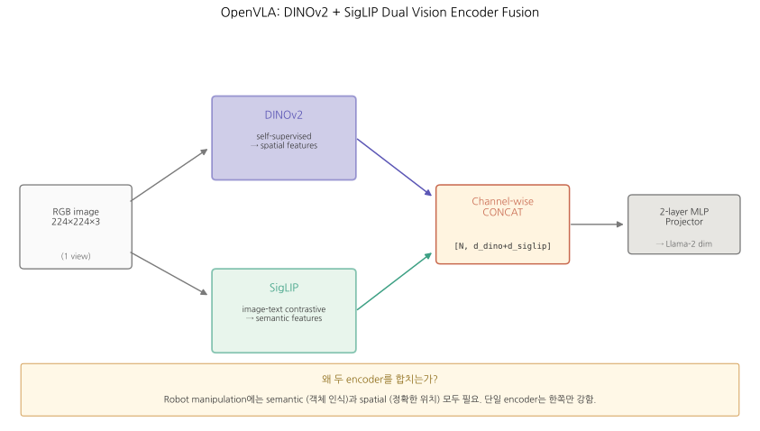
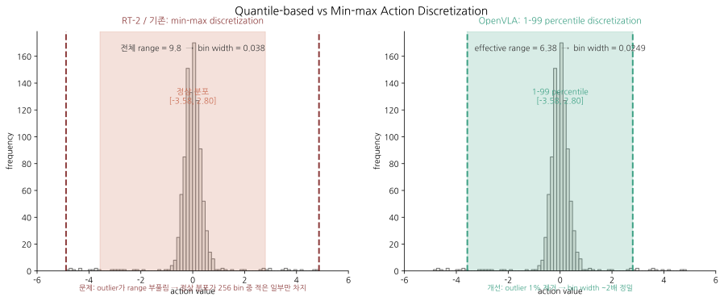
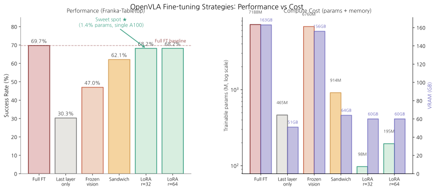

# OpenVLA: An Open-Source Vision-Language-Action Model

> **출처**: Kim, Pertsch, Karamcheti et al. (Stanford, UC Berkeley, TRI, Google DeepMind, Physical Intelligence, MIT), 2024. arXiv:2406.09246 (v3, 5 Sep 2024). Project: https://openvla.github.io
> **읽은 일자**: 2026-05-19
> **PDF**: [`papers/core-models/OpenVLA-An-Open-Source-Vision-Language-Action-Model.pdf`](../../papers/core-models/OpenVLA-An-Open-Source-Vision-Language-Action-Model.pdf)
> **분량**: 본문 11 페이지 + 부록 26 페이지 = 37 페이지

---

## 한 줄 요약

RT-2의 오픈소스 후속. **Llama-2 7B + DINOv2+SigLIP 융합 비전 인코더** 위에 OpenX-Embodiment 970K episode를 fine-tune해서, **7배 작은 모델로 RT-2-X 55B를 16.5pp 능가**. 추가로 **LoRA 기반 효율 fine-tuning**과 **int4 quantization**으로 consumer-grade GPU 운영 가능성 입증.

## TL;DR

- **RT-2와 동일 패러다임** (action을 256 bin discretize → text token으로 표현 → next-token prediction)이지만 **풀 오픈**: weights + code + training pipeline 모두 공개
- **새로운 architectural choice**: SigLIP(semantic) + DINOv2(spatial) 두 비전 인코더의 feature를 **channel-wise concatenate** → 단일 SigLIP보다 manipulation 성능 ↑
- **데이터 스케일**: Open X-Embodiment(OpenX) **970K episode** (RT-2-X의 350K 대비 ~3x). 22+ robot embodiment 통합
- **Fine-tuning 실용성 입증**: **LoRA rank=32**로 전체 파라미터의 1.4%만 학습해도 full fine-tuning과 동등한 성능 — 8x compute 절감
- **추론 효율**: int4 quantization으로 7GB GPU에서 71.9% (bf16 16.8GB에서 71.3%) — 성능 손실 없이 메모리 ½
- 한계: **co-fine-tuning 없음** (semantic generalization에서 RT-2-X에 일부 뒤짐), **single image** (multi-camera·proprioception·history 미지원), **6 Hz** (ALOHA의 50Hz 미달)

---

## 1. Motivation & 문제 정의

### 1.1 풀려는 문제

RT-2가 VLA 패러다임을 정립했지만, **연구 커뮤니티 입장에서 두 가지 큰 장벽**이 남았다:

1. **닫힌 모델**: RT-2-X, RT-2, RFM-1 등 모두 closed. Architecture·training procedure·data mixture를 다 볼 수 없고, 재현 불가.
2. **Fine-tuning 미연구**: VLA를 **새 robot setup/task에 어떻게 효율적으로 적응시킬지** 아무도 체계적으로 다루지 않음. 특히 **consumer-grade GPU**에서.

오픈 커뮤니티에서 VLA를 실제로 활용하려면, LLM 생태계처럼 **"오픈 weight + 효율적 fine-tuning recipe + 공식 codebase"** 3종 세트가 필요하다 (Llama-2, Mistral, Gemma 같은).

### 1.2 기존 방법의 한계

| 접근 | 사례 | 한계 |
|---|---|---|
| Closed VLA | RT-2 (Google), RFM-1 (Covariant), LINGO-2 (Wayve) | Reproduction 불가, fine-tuning 가이드 없음 |
| Open generalist policy (non-VLA) | Octo (93M), RT-1-X (35M) | VLM pretraining 없음 → semantic generalization 약함 |
| Visual rep only | R3M, VC-1, language-driven rep | Visual encoding만 풍부, language reasoning 부족 |
| Simulated VLA | RoboFlamingo 등 | Single robot/simulated setup, generality 부족 |

→ **open + scale + VLA pretraining + fine-tuning recipe**를 모두 만족하는 모델이 부재.

### 1.3 본 논문의 가설

> "Llama-2 같은 오픈 LLM backbone + DINOv2+SigLIP 비전 인코더 + Open X-Embodiment data로 7B VLA를 학습하면, 55B closed VLA(RT-2-X)를 능가할 수 있다. 추가로 LoRA·quantization 같은 LLM 도구들이 VLA에도 그대로 통한다."

이 가설이 맞다면:
- 오픈소스가 closed model보다 더 좋은 사례 ✓ (LLM에서도 Llama-3, Mixtral이 GPT-4를 부분적으로 따라잡았듯)
- VLA가 LLM 생태계의 모든 효율화 도구(LoRA, QLoRA, int4)와 호환됨
- 컴퓨팅 자원 없는 학교·스타트업도 robot manipulation에 진입 가능

## 2. 핵심 아이디어

### 2.1 한 줄

**"VLM을 robot data로 fine-tune해서 action을 text token으로 출력하게 만든다"**는 RT-2의 recipe를 **오픈 stack(Llama-2, DINOv2, SigLIP, OpenX)**으로 재현·확장하고, **fine-tuning·quantization·LoRA 같은 LLM 도구의 robot 응용**을 체계적으로 입증.

### 2.2 무엇이 새로운가

RT-2와 비교해서:

| 측면 | RT-2 (2023) | OpenVLA (2024) |
|---|---|---|
| Backbone | Closed PaLI-X / PaLM-E (5B~55B) | **Open Llama-2 7B** |
| Vision encoder | ViT-22B (PaLI-X 전용) | **SigLIP + DINOv2 fusion (~600M)** |
| Robot data | RT-1 dataset (~130K ep, 단일 robot) | **OpenX 970K ep, 22+ embodiment** |
| Co-training | 50~66% web data mix | **로봇만** (web data 안 씀) |
| Vision encoder | Frozen during fine-tune | **Fine-tune 함** ← 비표준 |
| Action discretization | min-max 256 bin | **1st-99th quantile 256 bin** |
| Inference | Cloud TPU, 1-3 Hz | **Single 4090, ~6 Hz** |
| Fine-tuning recipe | 없음 | **LoRA rank=32 권장** |
| Quantization | 없음 | **int4, 성능 손실 없음** |
| Code/Weights | Closed | **풀 공개** |

→ 핵심 contribution = **"오픈 stack으로 더 좋게 + fine-tuning·serving 도구 정립"**.

### 2.3 LLM/VLM 도구와의 analogy (RT-2와 공통 + 추가)

| LLM 개념 | OpenVLA 대응 | RT-2와 차이 |
|---|---|---|
| LoRA fine-tuning | LoRA rank=32 (1.4% params, single A100, 10-15h) | RT-2는 fine-tuning 없음 |
| QLoRA / int4 quant | int4 inference (7GB VRAM, bf16과 동등 성능) | RT-2는 quantization 없음 |
| Llama-2 backbone | 그대로 사용 | RT-2는 closed PaLI-X |
| HuggingFace transformers | AutoModel class 통합 | RT-2는 자체 stack |
| Patch-as-token VLM | DINOv2+SigLIP patch → projector → Llama embedding | RT-2는 PaLI-X 자체 방식 |
| FSDP (Fully Sharded Data Parallel) | 학습에 사용 (PyTorch native) | RT-2는 TPU/JAX |

→ OpenVLA는 LLM·VLM 분야에서 표준이 된 도구·인프라를 **그대로 robotics에 적용**. LLM 엔지니어가 사실상 추가 학습 없이 진입 가능.

## 3. 아키텍처 (상세)

### 3.1 입력 / 출력

| 항목 | 형식 | 차원 | 예시 |
|---|---|---|---|
| Vision | RGB image (single, 1장) | 224×224×3 | 작업대 frame |
| Language prompt | 자연어 instruction | text | `"In: What action should the robot do to put eggplant in bowl?\nOut:"` |
| Robot state | **명시적 입력 없음** | — | 이미지에서 implicit 학습 |
| Output | 7개 action token | 7 token | `"<act_128> <act_91> ... <act_142>"` |

**Action vector** (7-DoF):
```
action = [Δpos_x, Δpos_y, Δpos_z, Δrot_x, Δrot_y, Δrot_z, gripper]
```
- terminate token 없음 (RT-2는 8 token = 1 terminate + 7 continuous; OpenVLA는 그냥 7 token)
- Episode termination은 별도 처리

### 3.2 Backbone — Prismatic-7B VLM 기반

OpenVLA는 **Prismatic-7B VLM** (Karamcheti et al. 2024)을 시작점으로 함. Prismatic의 구조:

```
┌─────────────────────────────────────────────────────────────┐
│                    Prismatic-7B VLM                          │
│                                                              │
│  Image (224×224)                                             │
│      │                                                       │
│      ├──→ DINOv2 ViT     ─┐  (~300M params, spatial)        │
│      │                     │                                 │
│      └──→ SigLIP ViT     ─┴─→ channel-wise CONCAT            │
│                              │                                │
│                              ▼                                │
│                       [patches × 2048 dim]                    │
│                              │                                │
│                              ▼                                │
│                    2-layer MLP Projector                      │
│                       (visual features                        │
│                        → Llama embed dim)                     │
│                              │                                │
│                              ▼                                │
│      Text prompt ─→ Llama Tokenizer ─→ Llama 2 7B            │
│                                            │                  │
│                                            ▼                  │
│                                  next-token prediction        │
└─────────────────────────────────────────────────────────────┘
```

**파라미터 분포**:
- DINOv2 + SigLIP ≈ 600M
- 2-layer MLP projector: 작음 (수 M)
- Llama-2 7B
- 총 ≈ **7B (정확히는 7.18B)**

### 3.3 핵심 모듈 1: Dual Vision Encoder Fusion (DINOv2 + SigLIP)

OpenVLA의 가장 큰 아키텍처적 새로움. **왜 두 비전 인코더를 동시에 쓰는가?**


*DINOv2 (spatial) + SigLIP (semantic) feature를 channel-wise concat 후 MLP projector로 Llama-2 embed space에 매핑.*

| 비전 인코더 | 강점 | 약점 |
|---|---|---|
| **CLIP / SigLIP** | Web text-image contrastive 학습 → **semantic** 강함 ("이게 사과다") | Spatial precision 약함 (정확한 위치) |
| **DINOv2** | Self-supervised visual contrastive 학습 → **spatial/dense** 강함 (texture, depth, position) | Semantic labeling 약함 |

→ **둘을 결합하면 semantic + spatial이 모두 보강**된다. Robot manipulation은 **둘 다 필요**:
- "사과를 집어라" → 사과 인식 (semantic) + 사과의 정확한 위치·자세 (spatial)

**Fusion 방식 — channel-wise concatenation**:

```python
# pseudocode
dinov2_features = DINOv2(image)      # [B, N_patches, D_dino]   D_dino  ≈ 1024
siglip_features = SigLIP(image)      # [B, N_patches, D_siglip] D_siglip ≈ 1152
fused = torch.cat([dinov2_features, siglip_features], dim=-1)  # [B, N_patches, D_dino + D_siglip]
projected = MLP_projector(fused)     # [B, N_patches, D_llama]  D_llama = 4096
```

Patch 단위로 같은 위치의 두 feature를 concat. 그 후 MLP projector로 Llama embedding space에 매핑.

**실험적 증거** (Section 3.4의 ablation):
- Prismatic (DINOv2+SigLIP) vs LLaVA (CLIP만): **+10pp** success rate
- LLaVA vs IDEFICS-1: **+35pp** in language grounding (multi-object)

### 3.4 핵심 모듈 2: Action Tokenization

**RT-2와 동일한 핵심 아이디어** + **세 가지 미세 차이**:

#### Step 1. Continuous action을 256 bin으로 discretize

각 차원의 continuous action $a_i$에 대해:

$$
\text{bin}(a_i) = \left\lfloor \frac{a_i - q_{1\%}}{q_{99\%} - q_{1\%}} \times 256 \right\rfloor
$$

**RT-2와의 차이**:
- RT-2: $[a_{\min}, a_{\max}]$ 사용 (min-max)
- **OpenVLA: $[q_{1\%}, q_{99\%}]$ 사용 (1st-99th quantile)** ← 더 robust

**왜 quantile?** Robot trajectory data에는 outlier가 많다 (예: gripper 명령이 갑자기 100배 큰 값). Min-max를 쓰면 bin width가 이 outlier 때문에 부풀려져서 정상 동작의 정밀도가 떨어진다. 1~99 percentile을 쓰면 outlier가 제거되어 **effective granularity가 약 100배 향상**.


*Min-max는 outlier가 range를 부풀려 정상 분포가 좁은 bin 범위에 압축됨. Quantile-based는 outlier 1%를 제거하여 bin width가 ~100배 정밀.*

#### Step 2. Bin index → Llama token ID 매핑

Llama-2 tokenizer는 **`special_tokens` slot이 100개**밖에 없다. 256개 action token이 필요하므로:

```python
# pseudocode
llama_tokenizer.vocab_size = 32000   # base
# 가장 안 쓰이는 token 256개 = vocab의 마지막 256 slot (id 31744 ~ 31999)
ACTION_TOKEN_OFFSET = 31744
action_token_id = ACTION_TOKEN_OFFSET + bin_index   # bin 0 ~ 255 → token 31744 ~ 31999
```

→ Llama vocab의 마지막 256개 token을 **action 의미로 재학습** (= RT-2-PaLM-E와 같은 symbol tuning).

#### Step 3. Loss는 action token만 evaluate

RT-2의 학습은 robot data의 모든 token에 loss를 매기지만, OpenVLA는:

$$
\mathcal{L} = -\sum_{t \in T_{\text{action}}} \log p_\theta(y_t \mid y_{<t}, x)
$$

where $T_{\text{action}}$ = action token position만 (text prompt token, 비-action 위치는 mask out).

이렇게 하면:
- Web data가 없어도 catastrophic forgetting이 적음 (loss가 robot specific만 보니까)
- 학습 신호가 action prediction에 집중

#### 구체 예시 — 실제 training sample

**Input string** (Llama tokenizer로 tokenize):
```
"In: What action should the robot take to put eggplant in bowl?\nOut:"
```
+ image patches (DINOv2+SigLIP features)

**Target string**:
```
"<act_128> <act_91> <act_241> <act_5> <act_101> <act_127> <act_142>"
   Δpos_x   Δpos_y   Δpos_z   Δrot_x   Δrot_y   Δrot_z   gripper
```
(실제로는 token ID 31744+128 = 31872 같은 정수. `<act_X>` 는 표기 편의.)

Loss는 위 7 token의 NLL만 합산. Input의 "In: ..." 부분은 loss에 포함 안 됨.

### 3.5 전체 다이어그램

```
┌─────────────────────────────────────────────────────────────────┐
│ Input                                                            │
│  ┌─────────────────┐   ┌─────────────────────────────────────┐  │
│  │ RGB 224×224     │   │ "In: What action should the robot   │  │
│  │ (single frame)  │   │  take to put eggplant in bowl?      │  │
│  └─────────┬───────┘   │  Out:"                              │  │
│            │            └──────────────┬──────────────────────┘  │
└────────────┼─────────────────────────────┼─────────────────────┘
             │                             │
        ┌────┴────┐                        ▼
        │         │                ┌──────────────┐
        ▼         ▼                │ Llama        │
   ┌─────────┐ ┌─────────┐         │ Tokenizer    │
   │ DINOv2  │ │ SigLIP  │         └──────┬───────┘
   │  ViT    │ │  ViT    │                │ text tokens
   │ (300M)  │ │ (300M)  │                │
   └────┬────┘ └────┬────┘                │
        │           │                     │
        └─────┬─────┘                     │
              ▼                           │
       channel-wise CONCAT                │
              │                           │
              ▼                           │
       ┌──────────────┐                   │
       │ 2-layer MLP  │                   │
       │  Projector   │                   │
       └──────┬───────┘                   │
              │ image patch tokens (4096-dim Llama embed)
              ▼                           │
       ┌──────────────────────────────────┴──────┐
       │  Llama 2 7B Decoder                     │
       │  next-token prediction                  │
       │  (loss masked: only action tokens)     │
       └──────┬──────────────────────────────────┘
              │
              ▼
       7 action tokens: 31872, 31835, ..., 31886
              │
              ▼ de-tokenize (id → bin → real value)
       action = [Δpos_x=0.001, ..., gripper=0.55]
              │
              ▼
       Robot controller (closed-loop, ~6 Hz on 4090)
```

## 4. 데이터 (상세)

### 4.1 Open X-Embodiment (OpenX) 데이터셋

- **전체 OpenX**: 70+ robot datasets, **2M+ trajectories**, 22+ embodiments. 커뮤니티 통합 노력의 결과.
- **OpenVLA가 사용한 부분**: 그 중 **970K episodes**를 curate.

#### Curation 기준

(1) **Coherent input/output**: 모든 데이터셋이 단일 input/output space로 정렬되어야 함
- Manipulation only (navigation 등 제외)
- **At least one 3rd-person camera**
- **Single-arm end-effector control**

(2) **Balanced mixture**: 데이터셋 diversity에 따라 가중치 차등화
- Octo (Octo Model Team 2023)의 mixture weights를 그대로 채택
- Diversity 높은 데이터셋(예: Bridge, Fractal, Kuka) ↑, narrow 데이터셋 ↓

#### Mixture 표 (요약, 부록 A)

| Dataset | 비중 |
|---|---|
| **Bridge** (Walke 2023) | **13.3%** |
| **Fractal** (Brohan 2023) — Google robot | **12.7%** |
| **Kuka** (Kalashnikov 2018) | **12.7%** |
| **DROID** (Khazatsky 2024) | 10.0% → 0% (last 1/3 학습에서 제거) |
| BC-Z, FMB, Stanford Hydra, Language Table 등 | 각 1~7% |
| Berkeley Cable Routing, UCSD Kitchen 등 niche | <1% |

**총 25+개 데이터셋** 통합.

#### DROID 실패 사례 (저자가 솔직히 보고함)

DROID (50K+ episode 대규모 데이터셋)를 10% 비중으로 추가했으나, **학습 내내 DROID의 action token accuracy가 낮게 유지**됨. 이유 추정:
- DROID의 task diversity가 너무 커서 7B 모델이 fit하기 어려움
- 더 큰 mixture weight 또는 더 큰 모델이 필요할 듯

→ 학습 마지막 1/3에서 DROID 제거. 가중치는 다른 데이터셋에 재분배.

### 4.2 RT-2와의 데이터 비교

| 항목 | RT-2 | OpenVLA |
|---|---|---|
| Robot episodes | ~130K (RT-1 single dataset) | **970K (25+ datasets)** |
| Embodiments | 1 (mobile manipulator) | **22+ (WidowX, Franka, Kuka, Google, etc.)** |
| Web data co-training | 50~66% | **없음 (로봇만)** |
| Data scale | Internet-scale dominant | **Robot-scale dominant** |

**중요한 트레이드오프**: OpenVLA는 web data를 안 쓴다. 이 때문에:
- Semantic generalization은 RT-2-X에 일부 뒤짐 ("photo of Taylor Swift" 같은 task)
- 그러나 robot data diversity가 충분히 커서 (22 embodiment, 970K) **manipulation 자체는 더 잘함**

### 4.3 전처리 — 중요한 디테일

**BridgeData V2 데이터에서 발견한 함정**: 매 demonstration의 **첫 timestep에 모든 차원이 0인 action**이 기록되어 있음. 그대로 학습하면 모델이 "처음에는 안 움직임"을 학습 → evaluation에서 **freeze behavior** 발생.

OpenVLA: **첫 transition을 모두 filter out**.
RT-2-X: 이 전처리 없이 학습됨 → workaround로 **2nd-most-likely action을 query**해서 사용.

→ 이게 OpenVLA가 BridgeData V2에서 RT-2-X를 +20pp 능가한 한 원인.

## 5. 학습 (상세)

### 5.1 Loss

$$
\mathcal{L}_{\text{OpenVLA}}(\theta) = -\mathbb{E}_{(x, y) \sim D_{\text{robot}}} \left[ \sum_{t \in T_{\text{action}}} \log p_\theta(y_t \mid y_{<t}, x) \right]
$$

기호:
- $\theta$: Llama-2 7B + DINOv2 + SigLIP + projector 모든 weight
- $x$: image + text prompt
- $y$: 7 action token
- $T_{\text{action}}$: action token 위치만 (text prompt 부분 mask out)
- $D_{\text{robot}}$: Open X 970K episodes (web data **포함 안 됨**)

**RT-2와의 핵심 차이**: $D_{\text{robot}}$ 뿐. RT-2는 $w \cdot D_{\text{robot}} + (1-w) \cdot D_{\text{web}}$.

### 5.2 Hyperparameter

| Hyperparameter | 값 | 비고 |
|---|---|---|
| **LR** | 2e-5 (constant) | Prismatic VLM 학습 시와 동일. **No warmup, no decay** |
| **Batch size** | 2048 | 64 A100 across nodes |
| **Epochs** | **27** | (RT-2 등 LLM은 1-2 epoch 표준) |
| **Compute** | **64 A100 GPUs × 14일 = 21,500 A100-hours** | |
| **Image resolution** | 224×224 | (384×384 시도했으나 동등 성능, 3x 시간) |
| **Precision** | bfloat16 (training), bf16/int4 (inference) | |
| **Parallelism** | FSDP (Fully Sharded Data Parallel) | PyTorch native |

### 5.3 핵심 설계 결정 (Section 3.4 ablations)

저자들이 BridgeData V2 sub-experiment로 ablation한 결정들:

#### (a) VLM Backbone 선택

| Backbone | Bridge 5-task 평균 | 비고 |
|---|---|---|
| IDEFICS-1 | (baseline) | |
| LLaVA | +35pp | language grounding 강함 |
| **Prismatic (DINOv2+SigLIP)** | **+10pp on top of LLaVA** | spatial reasoning 보강 |

→ Prismatic 선택 (≈ +45pp over IDEFICS-1).

#### (b) Image Resolution

| Resolution | 성능 | 학습 시간 |
|---|---|---|
| 224×224 | baseline | 1x |
| 384×384 | **동등** (no improvement) | 3x |

→ **VLA에서는 high-res가 도움 안 됨** (놀라운 결과). VLM benchmark에서는 효과 있는데, manipulation task에서는 그렇지 않음. Robot data의 visual complexity 한계 추정.

→ 224 채택.

#### (c) Vision Encoder Fine-tuning

| 설정 | Bridge 평균 | 이유 |
|---|---|---|
| **Vision encoder fine-tune** | **높음** | **OpenVLA의 핵심 비표준 결정** |
| Vision encoder freeze (VLM 표준) | 낮음 | Robot의 fine-grained spatial 정보 부족 |

**왜 표준과 다른가?** VLM 학습에서는 통상 비전 인코더를 freeze (Karamcheti 2024 발견). 이유: pretrained robust feature가 깨지지 않게.

그러나 OpenVLA에서 freeze하면 manipulation 성능 크게 떨어짐. 추정 이유: VLM benchmark는 거시적 visual concept (객체 카테고리 등)만 필요하지만, manipulation은 **객체의 미세한 위치·방향·거리** 같은 fine-grained spatial detail이 필요. 이를 위해 vision encoder가 robot domain으로 adapt되어야 함.

→ **이는 향후 VLA 학습의 일반 규칙으로 자리잡음**.

#### (d) Epochs

| Epochs | 성능 |
|---|---|
| 1-2 (LLM 표준) | 낮음 |
| **27 (최종)** | **action token accuracy 95%+** |

LLM/VLM은 1-2 epoch가 표준이지만, VLA는 훨씬 많은 epoch가 필요. Robot data가 internet text보다 훨씬 narrow하기 때문에 reuse가 가능하고 필요함.

#### (e) Learning Rate

여러 order of magnitude sweep 후 **2e-5 constant**가 최선. **LR warmup, decay 모두 도움 안 됨**.

### 5.4 Inference Infrastructure

**메모리·속도**:
- bfloat16 inference: **15 GB VRAM**, ~6 Hz on RTX 4090
- int4 quantization: **7 GB VRAM**, ~3 Hz on A5000
- 8-bit quantization: **10 GB VRAM**, 1.2 Hz (slow!)

**왜 8-bit가 4-bit보다 느린가?** 양자화 overhead 때문. 4-bit는 메모리 전송이 너무 줄어들어 quantization cost를 보상하지만, 8-bit는 절반만 줄어들어 보상 안 됨. 흥미로운 발견.

**Remote inference server**: 별도 GPU 서버에서 추론, 작은 robot host로 action streaming. Open source로 제공.

## 6. 평가 (상세)

### 6.1 Setup

3가지 평가축:
1. **Out-of-the-box** generalist 성능 (WidowX, Google robot)
2. **Fine-tuning** 능력 (Franka 환경 7-task)
3. **Parameter-efficient fine-tuning** + **quantization** 성능·자원 trade-off

### 6.2 Baselines

| Baseline | 종류 | 파라미터 | 특징 |
|---|---|---|---|
| **RT-1-X** | Transformer policy | 35M | OpenX로 from-scratch 학습 |
| **Octo** | Transformer policy | 93M | OpenX, 가장 강한 open generalist |
| **RT-2-X** | VLA | **55B** | Closed, OpenX의 350K subset 사용 |
| **Diffusion Policy** | Diffusion-based | ~수십M | From-scratch imitation learning, action chunking |

### 6.3 핵심 결과 1 — BridgeData V2 (WidowX, 17 tasks, 170 rollouts)

논문 Figure 3 / Table 4. 평균 success rate (±SE):

| Model | Avg Success | Visual Gen | Motion | Physical | Semantic | Lang Grounding |
|---|---|---|---|---|---|---|
| RT-1-X (35M) | 18.5% | low | low | low | low | low |
| Octo (93M) | 20.0% | low | low | low | low | low |
| RT-2-X (55B) | 50.6% | 중상 | 중상 | 중상 | **높음** | 중상 |
| **OpenVLA (7B)** | **70.6%** | **높음** | **높음** | **높음** | 중 (RT-2-X에 일부 뒤짐) | **높음** |

해석:
- **OpenVLA가 7B로 55B를 +20pp 능가**
- Semantic generalization에서만 RT-2-X에 약간 뒤짐 → web co-training의 효과 (OpenVLA는 안 함)
- 모든 다른 axis에서 OpenVLA 우위

**왜 7B로 55B를 이기는가?** 3가지 요인:
1. **데이터 양·다양성**: 970K vs 350K
2. **데이터 품질**: BridgeData zero-action filter
3. **Vision fusion**: DINOv2 + SigLIP

### 6.4 핵심 결과 2 — Google Robot (12 tasks, 60 rollouts)

| Model | Avg Success | In-distribution | OOD |
|---|---|---|---|
| RT-1-X | 33.3% | high (40-100%) | low |
| Octo | 26.7% | mixed | very low |
| RT-2-X (55B) | **78.3%** | high | high |
| **OpenVLA (7B)** | **85.0%** | high | high |

해석:
- OpenVLA와 RT-2-X **비등** (overlapping error bars, paper도 둘 다 bold)
- Google robot은 RT-2의 home turf인데도 OpenVLA가 약간 우위

### 6.5 핵심 결과 3 — Fine-tuning on New Robot (Franka)

OpenVLA를 OpenX-pretrained 상태에서 새 robot/task에 **full fine-tune** (10-150 demonstrations):

| Model | Franka-Tabletop Avg | Franka-DROID Avg |
|---|---|---|
| Diffusion Policy (from scratch) | 48.5% | 35.0% |
| Diffusion Policy (matched) | 43.4% | 26.7% |
| Octo (fine-tuned) | 43.4% | 38.3% |
| OpenVLA **(scratch, no OpenX pretrain)** | 43.4% | 21.7% |
| **OpenVLA (fine-tuned)** | **67.2%** | **58.3%** |

해석:
- **OpenX pretraining이 결정적**: scratch 43.4% vs pretrained 67.2% → +24pp
- Diffusion Policy는 narrow single-task에서 강함 (Pour Corn 100%, OpenVLA 50%)
- OpenVLA는 **diverse multi-instruction task에서 압도적** (Move <object> onto Plate: OpenVLA 75% vs Diffusion 25%)
- → OpenVLA는 **모든 task에서 50%+** 달성하는 유일한 모델 (low-variance default option)

### 6.6 핵심 결과 4 — Parameter-Efficient Fine-tuning (Table 1)

7B 모델 full fine-tune은 2x A100 (163GB VRAM) 필요. 더 가볍게 fine-tune할 수 있을까?

| Strategy | Success Rate | Train Params (M) | VRAM (batch 16) |
|---|---|---|---|
| **Full FT** | 69.7% ± 7.2 | 7188 (100%) | 163 GB (FSDP 2x A100) |
| Last layer only | 30.3% | 465 (6.5%) | 51 GB |
| Frozen vision | 47.0% | 6760 (94%) | 156 GB |
| Sandwich (vision + emb + last) | 62.1% | 914 (12.7%) | 64 GB |
| **LoRA rank=32** | **68.2%** | **97.6 (1.4%)** | **60 GB** ★ |
| LoRA rank=64 | 68.2% | 195.2 (2.7%) | 60 GB |


*성능 vs 비용. LoRA r=32가 Full FT와 동등 성능을 1.4% params + 60GB VRAM (single A100)로 달성.*

**핵심 발견**:
- **LoRA r=32가 Full FT와 동등 성능**, 단 **1.4% params만 학습**
- VRAM: 163GB → 60GB → **single A100 (80GB)** 충분
- 학습 시간: 8x reduction (full 5-15h → LoRA 10-15h on single A100)
- **r=32 vs r=64 차이 없음** → r=32 권장

**왜 LoRA가 작동하나?**
- LoRA는 weight matrix $W$를 $W + AB$ ($A$ low-rank, $B$ low-rank)로 보정. 즉 small intrinsic update만 학습
- VLA fine-tuning은 fundamental knowledge re-learning이 아니라 **task-specific adaptation** → low intrinsic rank 가설 부합
- LLM에서 검증된 결과가 VLA에 그대로 적용

**왜 Last-layer only는 안 되나?**
- Visual feature adaptation이 안 됨 → robot domain의 fine-grained spatial 학습 불가
- Sandwich (vision + last)가 64GB로 비슷한 메모리에 +32pp → vision encoder 학습이 결정적

### 6.7 핵심 결과 5 — Quantization (Table 2, Fig 6)

bf16, int8, int4 비교:

| Precision | Bridge Success | VRAM |
|---|---|---|
| **bfloat16** | 71.3% ± 4.8 | 16.8 GB |
| int8 | **58.1%** ± 5.1 | 10.2 GB |
| **int4** | **71.9%** ± 4.7 | **7.0 GB** ★ |

**예상치 못한 발견**:
- **int4가 bf16과 동등** (실제로는 미세하게 더 높음!)
- **int8이 가장 나쁨** ← 추론 속도 저하 때문 (1.2 Hz on A5000)
- int4는 메모리 transfer 절감이 더 커서 속도 회복

**시사점**: bf16과 int4 둘 다 권장. int8은 피해야 함. **LLM serving 베스트 프랙티스가 VLA에도 그대로 통한다**.

### 6.8 결과 해석 — 종합

**OpenVLA가 RT-2-X(55B)를 이긴 본질적 이유**:

1. **데이터 우위** (970K vs 350K): 더 다양한 robot/task → 일반화 ↑
2. **Vision fusion** (DINOv2 + SigLIP vs PaLI-X 단일): spatial + semantic 양쪽 강화
3. **Cleaner data** (zero-action filter): freezing 방지
4. **충분한 compute**: 27 epochs, 64 A100 14일

**OpenVLA가 RT-2-X에 진 영역**:
- Semantic generalization (Move Coke Can to Taylor Swift) — web co-training 부재
- → **co-training 필요 시 OpenVLA에 추가하면 그 격차도 해소될 가능성**

## 7. 강점 / 한계

### 7.1 강점

| 강점 | 구조적 원인 |
|---|---|
| 풀 오픈 (weights + code + data mixture) | LLM 생태계의 도구·인프라 재활용 가능 |
| 7B로 55B 능가 | Dual vision encoder + 더 큰 cleaner data |
| LoRA 통한 효율 fine-tune | 1.4% params만 학습, single A100에서 가능 |
| int4 quantization 손실 없음 | LLM serving 표준 그대로 통함 |
| Consumer GPU(4090) 6 Hz | bf16 + standard transformer optimizations |
| FSDP/HuggingFace 통합 | LLM 인프라 그대로 |

### 7.2 한계 — Mechanism 분석

| 한계 | 구조적 원인 | 후속 모델이 어떻게 해결? |
|---|---|---|
| **Single image only** | Vision encoder가 1장 input만 처리 | π0: multi-view + state input. ALOHA: bi-camera. Interleaved VLM 활용 가능 |
| **No proprioception/state input** | 입력에 robot state(joint angle) 없음 | π0.5: explicit state token. Force/tactile 통합 |
| **No history (markovian)** | 한 step 의사결정만 | π0.7: memory module. World model 기반 |
| **6 Hz inference limit** | 7B forward pass × discrete token decoding | π0-FAST: action chunk + tokenization 효율화. Speculative decoding |
| **<90% success ceiling** | Pretraining data가 충분히 클린·다양하지 않음 | 더 큰 robot dataset 수집, RL fine-tune (π★0.6 의 RECAP) |
| **No web co-training** | 학습 mixture에 web data 없음 | RT-2 방식 적용 또는 더 강한 VLM backbone |
| **22 embodiment 한계** | OpenX 안의 robot에 제한 | X-VLA: soft prompt로 새 embodiment 즉시 adapt |
| **Discrete 256 bin ceiling** | Dexterous task 정밀도 한계 (folding 등) | π0 / Diffusion Policy: continuous flow/diffusion head |
| **No action chunking** | 매 step 1 action → 50step trajectory면 50 inference | ACT / π0: k step 한번에 |

→ RT-2의 한계 표와 거의 동일한 구조. **OpenVLA는 RT-2의 오픈 버전**이라서 한계도 같이 상속.

## 8. 다른 모델과의 관계

### 8.1 직접적 선행

- **[[RT-2]]** (Brohan 2023): 동일 패러다임. OpenVLA의 closed counterpart. (→ 우리 RT-2.md 참고)
- **[[Prismatic-7B]]** (Karamcheti 2024): VLM backbone 그대로 사용. DINOv2+SigLIP fusion의 출처
- **[[Open X-Embodiment]]** (Padalkar 2023): 데이터셋. RT-2-X의 350K subset과 OpenVLA의 970K curated subset 차이가 핵심 데이터 우위
- **[[Octo]]** (Octo Model Team 2023): Mixture weight 채택. Generalist policy baseline
- **[[Llama-2]]** (Touvron 2023): Language backbone

### 8.2 후속 (본 프로젝트 8편과의 연결)

| 후속 | OpenVLA와의 관계 |
|---|---|
| **[[SmolVLA]]** (HF, 2025) | OpenVLA를 더 경량화 (450M vs 7B). LeRobot stack 표준 |
| **[[pi0]]** (PI, 2024) | OpenVLA의 discrete token approach **반대 방향**. Continuous action expert (flow matching). VLM은 perception only |
| **[[pi0.5]]** (PI, 2025) | π0 + open-world generalization. OpenVLA의 OpenX 학습 idea 확장 |
| **[[pi-star-0.6]]** (PI, 2026) | π0.5 + RL self-improvement. OpenVLA의 static policy 한계 극복 |
| **[[pi0.7]]** (PI, 2026) | π★0.6 + steerable/compositional |
| **[[GR00T-N1]]** (NVIDIA, 2025) | OpenVLA 패러다임 + diffusion action head + humanoid |
| **[[X-VLA]]** / **[[Octo]]** | Cross-embodiment 강조. OpenVLA의 22 embodiment 한계 해결 |

### 8.3 Architecture-Evolution Tree에서의 위치

```
              RT-1 (35M, no VLM)
                │ + web pretraining (VLM)
                ▼
              RT-2 (closed, 5B-55B)
                │ + open backbone + larger/cleaner data + vision fusion
                ▼
           OpenVLA (7B, open)          ← 여기 ★
                │
                ├── + 경량화 ─────────────→ SmolVLA (450M)
                │
                ├── + flow matching head ──→ π0, π0.5, π★0.6, π0.7
                │   (token → continuous)
                │
                ├── + diffusion + humanoid ─→ GR00T N1
                │
                ├── + cross-embodiment ────→ X-VLA, Octo
                │
                └── + tactile/force ───────→ Rho-alpha
```

**OpenVLA는 "오픈 진영의 baseline"** 위치. 거의 모든 후속 오픈 모델이 OpenVLA를 reference로 비교.

## 9. 우리 스터디에서 재현·실험 가능한 포인트

### 9.1 재현 가능성

- **OpenVLA weights**: HuggingFace에 풀 공개 (`openvla/openvla-7b`)
- **Code**: `https://github.com/openvla/openvla` (PyTorch, FSDP support)
- **Training data mixture**: 명시되어 있음 (Appendix A)
- **재현 난이도**:
  - Full pretrain: 64 A100 × 14일 (21,500 A100-hours) — 매우 비쌈
  - **Fine-tune**: LoRA + single A100 + 10-150 demos → 10-15시간으로 가능 ✓
  - **Inference**: bf16 16GB GPU 또는 int4 7GB → consumer-grade 가능 ✓

### 9.2 우리 스터디 진입 경로 (Track B로 넘어갈 때)

**가장 현실적인 첫 실습**:
1. OpenVLA-7b weights 다운로드 (HuggingFace)
2. 1~2개 toy task에 LoRA fine-tune (Franka 또는 LeRobot의 SO-100 arm)
3. int4 inference로 실시간 작동 검증

**필요 자원** (LoRA fine-tune 기준):
- 1× A100 80GB or 1× H100
- 10-150 demonstrations (teleoperation 또는 simulator)
- 10-15 hours 학습

### 9.3 흥미로운 ablation / new idea 후보 (Track c)

| Idea | 메커니즘 | 기대 효과 | 난이도 |
|---|---|---|---|
| Web co-training 추가 | OpenVLA 위에 LLaVA mixture를 50% 추가하여 fine-tune | RT-2 대비 semantic gap 해소 가능성 | 중간 |
| Multi-view 확장 | Vision encoder가 N개 image를 patch-concat | Occlusion 극복 | 높음 (구현) |
| State input 추가 | Joint angle을 text prompt에 inject (e.g., `"joint=[0.1, ...]"`) | Force-sensitive task | 중간 |
| Action chunking (ACT 스타일) | Output을 1 step → k step | Latency·smoothness | 중간 |
| Continuous action head 교체 | Discrete token → diffusion / flow matching head | π0 vs OpenVLA 직접 비교 | 높음 |
| Vision encoder 비교 sweep | DINOv2+SigLIP vs DINOv2 only vs SigLIP only vs CLIP | Fusion 효과 정량화 | 중간 |
| Quantile range sweep | 1-99 vs 5-95 vs 10-90 percentile | Effective granularity vs robustness | 낮음 |
| LoRA target sweep | All linear vs attn only vs MLP only | LoRA placement 최적화 | 낮음 |
| Epochs sweep | 5, 10, 20, 27, 40 | Saturation point 정량화 | 중간 |

### 9.4 LeRobot / openpi / OpenVLA stack 호환성

- **OpenVLA repo (자체)**: 풀 공개, AutoModel 호환
- **LeRobot**: OpenVLA fork 또는 호환 wrapper 존재
- **openpi (Physical Intelligence)**: 다른 패러다임 (continuous action expert) — 직접 호환 안 됨
- **HuggingFace transformers**: AutoModel.from_pretrained 가능
- **bitsandbytes (4-bit)**: int4 quantization 즉시 사용 가능

### 9.5 LLM 엔지니어 관점 — 한 페이지 요약

OpenVLA = **"Llama-2 7B SFT, 단 input에 이미지 patch가 추가되고 output이 7개 action token으로 제한된다"**.

| 단계 | LLM 엔지니어 작업 비유 |
|---|---|
| 1. Backbone 선택 | Llama-2 7B 그대로 가져오기 |
| 2. Vision encoder 추가 | LLaVA-style: ViT → projector → embed concat |
| 3. Action token discretize | Special token 추가하는 것 (256개) |
| 4. SFT (= OpenX fine-tune) | Standard supervised fine-tuning |
| 5. Inference quantize | bitsandbytes int4 그대로 |
| 6. Downstream fine-tune | PEFT LoRA r=32 |
| 7. Serving | Remote VLM 서버 ↔ robot client streaming |

→ **LLM SFT 파이프라인을 거의 그대로 재사용**. Robotics 학습 비용이 인지적으로 매우 낮음.

---

## 부록: 인용 / 추가 자료

### A. 함께 읽기

- **[[RT-2]]** — OpenVLA의 직접적 baseline. 같은 패러다임의 closed 버전. 우리 RT-2.md 참고.
- **[[Open-X-Embodiment]]** — OpenVLA의 학습 데이터 출처. 데이터 curation의 중요성. **Phase 2 batch download 후 정독 권장**.
- **[[Prismatic]]** — VLM backbone 원논문. DINOv2+SigLIP fusion 결정의 근거. (Karamcheti 2024)
- **[[Diffusion-Policy]]** — OpenVLA가 Franka 실험에서 비교한 baseline. Action diffusion 접근.
- **[[ACT]]** — Action chunking. OpenVLA가 다음 단계로 도입 가능성 시사한 기술.
- **[[Octo]]** — Mixture weights 채택의 출처. Open generalist policy.

### B. 공식 자료

- Project page: https://openvla.github.io
- Code: https://github.com/openvla/openvla
- Weights: https://huggingface.co/openvla/openvla-7b
- Fine-tuning notebook: 공식 repo 안에 제공
- Remote inference server code: 공식 repo

### C. 본 요약 작성 중 발견한 핵심 참고

- **Prismatic-7B (Karamcheti 2024)** — DINOv2+SigLIP fusion이 spatial reasoning을 어떻게 향상시키는지 정량화한 논문. OpenVLA의 vision design 근거 전체.
- **Quantile-based discretization** — 처음에는 detail로 보였으나 RT-2 대비 effective granularity ~100x 향상. 작은 디테일이 큰 차이.
- **Vision encoder unfreeze** — VLM 학습의 표준(freeze)과 정반대 결정. VLA가 robot domain으로 visual feature를 adapt해야 한다는 새 발견.
- **27 epochs** — LLM 표준(1-2)과 다른 VLA 특유의 수렴 패턴.

### D. RT-2와의 비교 한눈에

| 차원 | RT-2 (2023) | OpenVLA (2024) | 어느 쪽 우위? |
|---|---|---|---|
| Backbone | PaLI-X 55B, PaLM-E 12B (closed) | Llama-2 7B (open) | OpenVLA (open, 7배 작음) |
| Vision | PaLI-X 전용 ViT-22B | DINOv2 + SigLIP fusion (600M) | OpenVLA (spatial + semantic) |
| Robot data | RT-1 130K, single embodiment | OpenX 970K, 22+ embodiment | OpenVLA (3x, diverse) |
| Web co-training | 50-66% mix | 없음 | RT-2 (semantic gen) |
| Action discretization | min-max 256 bin | quantile 256 bin | OpenVLA (robust) |
| Inference | Cloud TPU, 1-3 Hz | RTX 4090, 6 Hz, 4-bit 가능 | OpenVLA (consumer GPU) |
| Fine-tuning | 미연구 | LoRA r=32 → full FT 동등 | OpenVLA (체계화) |
| BridgeData V2 | 50.6% | 70.6% | OpenVLA (+20pp) |
| Google robot | 78.3% | 85.0% | OpenVLA (+7pp) |
| Closed/Open | Closed | Full open | OpenVLA |

→ **OpenVLA가 거의 모든 axis에서 우위**. 유일한 RT-2 우위는 semantic generalization (그것도 web co-training 추가하면 따라잡을 가능성).

### E. 우리 스터디에서 OpenVLA의 위치

이 논문 정독 후 우리 8편 정독 흐름에서 차지하는 의미:
- **RT-2 → OpenVLA**: 패러다임 검증 + 오픈 stack 정립
- **OpenVLA → SmolVLA**: 7B → 450M 경량화 (한 방향)
- **OpenVLA → π0**: discrete → continuous action expert (반대 방향)
- **OpenVLA → GR00T N1**: arm → humanoid + diffusion head
- **OpenVLA → X-VLA**: cross-embodiment 강화

→ 다음 정독으로 **SmolVLA**(경량 방향) 또는 **π0**(continuous 방향) 어느 쪽이든 OpenVLA를 baseline으로 비교하면 효율적.
