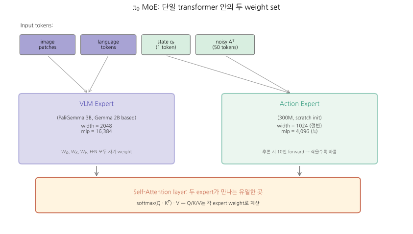
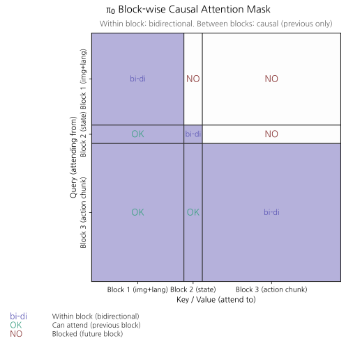
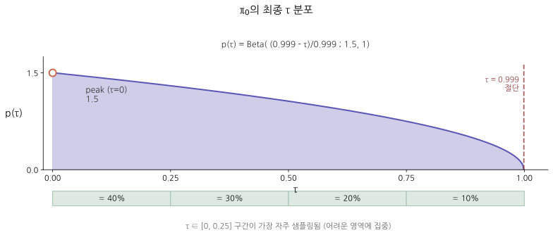
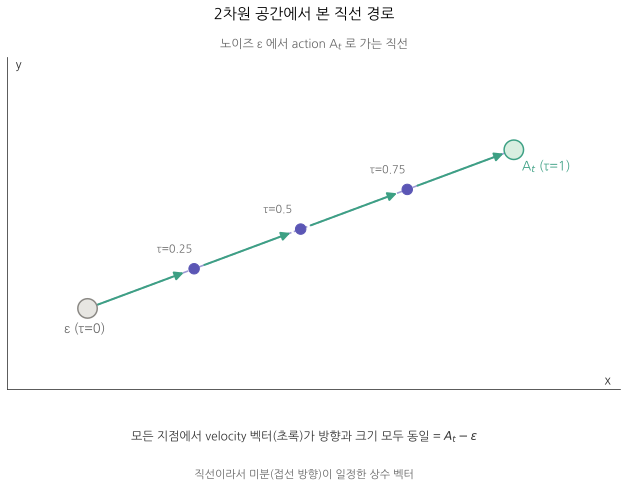

# π0: A Vision-Language-Action Flow Model for General Robot Control

> **출처**: Physical Intelligence (Black, Brown, Driess, ..., Finn, Levine, Pertsch, Vuong et al.), 2024. arXiv:2410.24164 (31 Oct 2024). Blog: https://physicalintelligence.company/blog/pi0
> **읽은 일자**: 2026-05-23
> **PDF**: [`papers/core-models/π 0 - A Vision-Language-Action Flow Model for General Robot Control.pdf`](../../papers/core-models/π%200%20-%20A%20Vision-Language-Action%20Flow%20Model%20for%20General%20Robot%20Control.pdf)
> **분량**: 본문 11 페이지 + 부록 6 페이지 = 17 페이지

---

## 한 줄 요약

**PaliGemma 3B VLM + 300M Flow Matching Action Expert** (총 3.3B) — VLM과 action expert를 **단일 transformer 안에 두 weight set의 mixture-of-experts**로 통합하고, **10,000시간** 자체 cross-embodiment data + OXE 9.1%로 사전학습 → 7 robot configurations / 68 tasks에서 zero-shot 작동, fine-tune으로 laundry folding 같은 **20분 dexterous task** 가능. OpenVLA·Octo·ACT·Diffusion Policy를 모든 zero-shot task에서 대폭 압도.

## TL;DR

- **SmolVLA의 큰 형**: 같은 paradigm (VLM + flow matching action expert)이지만 **3.3B vs 0.45B**, **10K hours vs 23K episodes** scale 차이
- **MoE 아키텍처** (Mixture of Experts) — 단일 transformer 안에 두 weight set: VLM (PaliGemma)은 이미지/언어 token, action expert는 state/action token. **interact only through self-attention**
- **Block-wise causal attention** (3 blocks): [images+language] → [state] → [action chunk]. Within block bidirectional, between blocks causal
- **Flow time τ sampling**: Beta(1.5, 1) **shifted to emphasize LOW τ** (high noise) — image generation의 reverse intuition
- **H=50 action chunk @ 50Hz**, ODE 10 step → consumer 4090에서 inference **73 ms 총** (image 14ms + obs 32ms + 10×action 27ms)
- **Pre-training + post-training** (LLM-style): diverse pre-training data로 recovery 능력, 고품질 post-training으로 task 수행력
- **Sample weighting**: $n^{0.43}$로 over-represented combination down-weight
- **Action dim = 18** (largest robot에 맞춤, smaller robot은 zero-padding)
- 한계: 데이터 조합 best practice 미정, 일부 task 안정성 부족, locomotion·navigation으로 일반화 미검증

---

## 1. Motivation & 문제 정의

### 1.1 풀려는 문제

기존 VLA(RT-2, OpenVLA)의 두 가지 본질적 한계:

1. **Discrete action token의 정밀도 한계** — 256 bin 양자화는 dexterous task(laundry folding, box assembly, egg packing 등)에 부족
2. **단일 step inference**: action chunking 미지원 → 50 Hz 같은 고주파 제어 불가

또한 robotics foundation model의 큰 그림 질문:
- **얼마나 큰 scale**이 필요한가? (전 시도들은 100s of trajectories 수준)
- **어떤 architecture**가 diverse data를 효과적으로 흡수하는가?
- **어떤 training recipe** (pre-train vs post-train mix)가 dexterity와 robustness 둘 다 줄까?

### 1.2 기존 방법의 한계 (π0 저자 관점)

| 접근 | 한계 |
|---|---|
| RT-2, OpenVLA (token-based VLA) | Discrete action → dexterous control 불가, action chunking 미지원 |
| ACT (Zhao 2023) | Action chunking은 잘 함, but VLM pre-training 없음 → semantic generalization 약함 |
| Diffusion Policy (Chi 2023) | Diffusion으로 multimodal action OK, but VLM 없음 + scale 작음 |
| Octo (93M, generalist) | Generalist + diffusion이지만 representational capacity 부족 |

→ **VLM pre-training + flow matching (continuous, multimodal action) + action chunking** 셋이 모두 결합된 모델은 부재.

### 1.3 본 논문의 가설

> "VLM pre-training의 의미적 일반화 + flow matching의 정밀 continuous action 생성 + action chunking의 고주파 제어를 결합하면, 단일 모델이 7 robots × 68 tasks를 zero-shot으로 처리하고 fine-tune으로 20분짜리 dexterous task까지 수행 가능하다."

핵심 가설 + 이를 뒷받침할 scale ("10,000시간 이상")이 결합되어야 효과 입증 가능.

## 2. 핵심 아이디어

### 2.1 한 줄

**"PaliGemma VLM에 action expert를 mixture-of-experts 형태로 부착하고 flow matching으로 학습 — 단일 transformer 안에 두 weight set이 self-attention으로만 상호작용"**

### 2.2 무엇이 새로운가

| 차원 | 이전 모델 | π0의 새로움 |
|---|---|---|
| Action 표현 | token (RT-2, OpenVLA) 또는 continuous (Octo, Diffusion Policy) | **continuous via flow matching** |
| VLM 활용 | unfreeze 전체 학습 (OpenVLA) 또는 사용 안 함 (Diffusion Policy) | **MoE 형태로 통합 — VLM 가중치 + action 가중치 두 set이 단일 transformer 안에 공존** |
| Action attention | autoregressive (RT-2) 또는 causal (SmolVLA) | **block-wise causal + 한 block 내에서는 bidirectional** |
| Scale | 130K episodes (RT-1) ~ 970K (OpenVLA) | **10,000 hours = 903M timesteps** (자체 데이터) + OXE 9.1% |
| Robot diversity | 1~22 robots | **7 robot configurations, 68 tasks** (자체) + OXE의 22 robots |
| Pre/post training | OpenVLA는 단일 단계 | **LLM-style pre/post training 명시적 분리** |
| Action frequency | RT-2 ~5 Hz, OpenVLA 6 Hz | **최대 50 Hz** (laundry folding 등 dexterous) |

### 2.3 LLM/VLM 도구와의 analogy

| LLM/VLM 도구 | π0 대응 |
|---|---|
| Mixture-of-Experts (Switch Transformer, GLaM) | **VLM expert + Action expert 두 weight set이 동일 transformer 내** |
| Multi-task pre-training + SFT post-training | **다양한 robot data로 pre-train → 고품질 task data로 post-train** |
| Block-wise causal mask (KV cache for inference) | **observation/state block은 한 번만 forward, action만 10번 forward** |
| DiT (Diffusion Transformer) + AdaLN-Zero | π0-small은 DiT + AdaLN-Zero 사용. π0 main은 다른 방식 (MLP로 τ embedding) |
| Speculative decoding (efficient inference) | **action chunk를 한 번에 → 25-50 step 동안 모델 호출 안 함** |
| Few-shot prompting | High-level VLM이 "pick up napkin" 같은 sub-task 명령을 자동 생성 → π0이 실행 |

핵심 통찰: π0는 **LLM 도구의 robotics 응용**이지만 SmolVLA보다 한 단계 깊은 통합 — MoE를 단일 transformer 안에 internal하게.

## 3. 아키텍처 (상세)

### 3.1 입력 / 출력

| 항목 | 형식 | 차원 | 예시 |
|---|---|---|---|
| Vision | 다중 RGB 이미지 (2-3개) | 각 이미지 encoder 통과 | top + wrist + side |
| Language | 자연어 명령 | text token | "fold the shirt" 또는 "pick up the red cup" |
| Robot state $q_t$ | proprioceptive (joint angles 등) | **18 (가장 큰 robot 기준, padded)** | linear projection |
| Output: action chunk $A_t$ | $a_t, a_{t+1}, ..., a_{t+H-1}$ | **H=50, dim=18** | continuous |

**중요한 padding 규칙**:
- Config vector $q_t$ + action vector $a_t$ 차원은 **항상 18** (dual-arm + 2 gripper + mobile base + torso)
- 작은 robot은 부족한 차원을 **0-padding**
- 카메라 수도 부족하면 **이미지 slot mask out**

이게 cross-embodiment 학습을 가능하게 함.

### 3.2 전체 다이어그램

```
┌──────────────────────────────────────────────────────────────────┐
│ Inputs                                                            │
│ ┌──────────────┐  ┌──────────────┐  ┌────────┐  ┌────────────┐  │
│ │ Image I₁,...In│  │ Language ℓ_t │  │State q │  │NoisyA^τ    │  │
│ │ (2-3 cameras) │  │ "fold shirt"│  │qt ∈ ℝ¹⁸│  │A^τ=[a₁..a₅₀]│  │
│ └──────┬───────┘  └──────┬───────┘  └────┬───┘  └─────┬──────┘  │
└────────┼───────────────────┼──────────────┼─────────────┼────────┘
         ▼                   ▼              ▼             ▼
   ┌──────────┐       ┌──────────┐    ┌─────────┐  ┌───────────┐
   │ ViT enc  │       │ Tokenizer│    │  Linear │  │  MLP w/   │
   │(PaliGem.) │       │          │    │  proj   │  │  τ embed  │
   └─────┬────┘       └────┬─────┘    └────┬────┘  └─────┬─────┘
         │ image tokens    │ text tokens   │ 1 token     │ H=50 tokens
         ▼                 ▼               ▼             ▼
┌──────────────────────────────────────────────────────────────────┐
│  Single Transformer (PaliGemma backbone) with 2 expert weights   │
│                                                                   │
│  Block 1 (images+lang)──→ VLM EXPERT weights (Gemma 2B)          │
│    width=2048, depth=18, mlp=16384                                │
│                ↓                                                  │
│  Block 2 (state)    ────→ ACTION EXPERT weights (~300M)          │
│    width=1024, mlp=4096                                           │
│                ↓                                                  │
│  Block 3 (action)   ────→ ACTION EXPERT weights                  │
│                                                                   │
│  Self-attention layers are where the 2 experts INTERACT:         │
│  - Different W_Q, W_K, W_V matrices per expert                   │
│  - But same overall attention computation                         │
│                                                                   │
│  Attention mask: blockwise causal                                 │
│    - Within each block: bidirectional                             │
│    - Between blocks: only previous → current                      │
│                                                                   │
└────────────────────────────────┬─────────────────────────────────┘
                                 │ outputs from action token positions
                                 ▼
                          ┌────────────┐
                          │ Linear proj │
                          └─────┬───────┘
                                │
                                ▼
                      velocity v_θ(A^τ, o_t) ∈ ℝ^{50 × 18}
                                │
                                ▼ ODE integration 10 step
                          Clean action chunk A_t
                                │
                                ▼
                       Robot controller @ up to 50 Hz
```

### 3.3 핵심 모듈 1 — Mixture-of-Experts in Single Transformer (가장 새로움)


*단일 transformer 안에 두 weight set. VLM expert (이미지+언어), Action expert (state+action). 두 expert는 self-attention layer에서만 상호작용.*

#### 기존 방식 vs π0 방식

| 방식 | 구조 | 예 |
|---|---|---|
| 두 separate transformer + cross-attention | VLM이 features 출력, 별 transformer가 action 생성 | **SmolVLA** |
| 단일 VLM이 모든 token (action 포함) 처리 | 한 transformer, 한 weight set | **RT-2, OpenVLA** |
| **MoE 단일 transformer + 두 weight set** | **하나의 transformer 구조, token type에 따라 다른 weight 사용** | **π0** ★ |

#### π0의 MoE 방식 세부

1 transformer에 두 expert weights:

**VLM Expert** (Gemma 2B 기반, PaliGemma에서 그대로):
- width = 2048, depth = 18, mlp_dim = 16384
- num_heads = 18, num_kv_heads = 1 (multi-query attention), head_dim = 256
- 토큰: 이미지 patches + language tokens

**Action Expert** (downsized, ~300M params, scratch initialization):
- width = **1024** (VLM의 절반), depth = 18 (동일!), mlp_dim = **4096** (VLM의 ¼)
- 토큰: state $q_t$ + noisy action $A^\tau$

**상호작용**:
- 각 expert는 **자기 W_Q, W_K, W_V, W_O matrices**를 가짐
- Self-attention에서 모든 token의 Q, K, V는 자기 expert weights로 계산
- 그 다음 attention computation은 정상 (softmax(QK^T)V)
- → **expert는 self-attention layer에서만 상호작용** (FFN에서는 따로)

```python
# pseudocode (single layer)
def transformer_layer(tokens):
    # 각 token의 type에 따라 다른 weight 사용
    for token in tokens:
        if token.type in ['image', 'language']:
            Q, K, V = vlm_expert.W_Q(token), vlm_expert.W_K(token), vlm_expert.W_V(token)
        else:  # state or action
            Q, K, V = action_expert.W_Q(token), action_expert.W_K(token), action_expert.W_V(token)
    
    # Self-attention: 모든 token Q가 모든 K, V와 (mask 따라) 계산
    output = blockwise_causal_attention(Q_all, K_all, V_all, mask)
    
    # FFN: 다시 type별 weight 사용
    for token in output:
        if token.type in ['image', 'language']:
            token = vlm_expert.W_O(vlm_expert.FFN(token))
        else:
            token = action_expert.W_O(action_expert.FFN(token))
    return output
```

#### 왜 이 구조인가?

이 design은 **Transfusion** (Zhou 2024)에서 영감. Original Transfusion은 한 transformer로 text (discrete, cross-entropy)와 image (continuous, diffusion)를 같이 학습.

π0의 변형:
- **2 weight set**: text와 robot action은 매우 다른 modality → 서로 다른 weight space에서 더 잘 representation됨
- **Action expert downsizing**: action token이 비교적 단순 → 더 작은 weight로 충분 + **inference 시 10번 forward해야 하므로 작을수록 좋음**
- **Self-attention만 공유**: VLM features가 action expert에 흘러들어가는 채널은 self-attention 뿐

이게 **LLM 분야 MoE (Switch Transformer, GLaM)와 본질적으로 같은 idea**지만:
- Switch Transformer: routing이 learnable + sparse activation
- π0: routing은 token type으로 **fixed** + dense activation (모든 token이 자기 expert 사용)

### 3.4 핵심 모듈 2 — Block-wise Causal Attention Mask


*3 blocks (image+lang / state / action). 블록 내 bidirectional, 블록 사이 causal forward만. State block 분리 덕분에 KV cache 가능 → ODE 10 step에서 reuse → inference ~5x 가속.*

3 blocks:

```
Block 1: [I_1, ..., I_n, ℓ_t]           ← images + language (VLM pre-training input)
Block 2: [q_t]                           ← robot state (single token)
Block 3: [a^τ_t, ..., a^τ_{t+49}]        ← noisy action chunk (H=50)
```

**Mask 규칙**:
- 한 block 내: **bidirectional attention** (모든 token이 서로 보기 가능)
- 다른 block 사이: **이전 → 다음**만 (forward causal)

```
                    Block 1 │ Block 2 │ Block 3
                 (img+lang) │ (state) │ (action)
              ┌──────────────┬─────────┬──────────┐
   Block 1   │       ↔↔↔    │    ✗    │    ✗     │  ← Block 1 can NOT see future blocks
              ├──────────────┼─────────┼──────────┤
   Block 2   │       ✓      │   (1)   │    ✗     │  ← Block 2 can see Block 1
              ├──────────────┼─────────┼──────────┤
   Block 3   │       ✓      │    ✓    │   ↔↔↔    │  ← Block 3 can see all + bidirectional within
              └──────────────┴─────────┴──────────┘
```

**왜 이 mask가 좋은가?**

1. **Block 1 (images+lang) → 이전 blocks 못 봄**:
   - VLM pre-training 시 PaliGemma는 이미지+언어만 봤음. 만약 state/action에 attend하면 distribution shift
   - → VLM 능력 보존을 위해 forward block 차단

2. **Block 2 (state) → 자기와 Block 1만 봄**:
   - State는 매 inference step에서 동일 (action만 변화)
   - **state token의 KV는 cache 가능** → ODE 10 step에서 재계산 안 함 → inference 가속

3. **Block 3 (action) → 모든 block에 attend + 내부 bidirectional**:
   - Action chunk가 perception, state 모두 reference
   - 내부 bidirectional: chunk 내 모든 action이 서로 보면서 **smooth trajectory**

**SmolVLA와의 차이**:
- SmolVLA action expert: **causal mask within actions** (autoregressive 안에서)
- π0: **bidirectional within actions** (chunk 전체 동시 생성)

π0의 bidirectional이 더 자연스러움 — flow matching은 한 chunk 통째 noise → data이므로 chunk 내 ordering이 인공적.

### 3.5 핵심 모듈 3 — Flow Matching Loss + τ Sampling

#### 3.5.1 Loss (SmolVLA와 동일 form)

$$
\mathcal{L}_\tau(\theta) = \mathbb{E}_{p(A_t | o_t), q(A^\tau_t | A_t)} \left\| v_\theta(A^\tau_t, o_t) - u(A^\tau_t | A_t) \right\|^2
$$

- $A_t = [a_t, ..., a_{t+H-1}]$: ground-truth action chunk, $H=50$
- $A^\tau_t = \tau A_t + (1-\tau)\epsilon$: noisy point on linear path
- $u(A^\tau_t | A_t) = \epsilon - A_t$: target velocity (학습 supervision)
- $v_\theta$: 모델 prediction = velocity
- → MSE on velocity space (SmolVLA의 §5.1과 동일 구조)

#### 3.5.2 τ 샘플링 — π0의 차별화 design

기존 방식들:
| 방식 | $p(\tau)$ | 특징 |
|---|---|---|
| Original flow matching (Lipman 2022) | Uniform on [0,1] | naive |
| Esser 2024 (Stable Diffusion 3) | logit-normal centered at 0.5 | 중간 τ 강조 (image generation) |
| **π0** | **shifted Beta(1.5, 1) emphasizing LOW τ** | **noise level 높은 부분 강조** |

수식 (Appendix B):
$$
p(\tau) = \text{Beta}\left(\frac{s - \tau}{s}; 1.5, 1\right), \quad s = 0.999
$$


*Shifted Beta 분포. τ=0에서 peak (1.5), τ=0.999에서 절단. τ ∈ [0, 0.25] 구간이 40%로 가장 자주 샘플링 — "학습 어려운 영역(high noise)에 집중".*


*노이즈 ε에서 action A_t로 가는 직선 path. 모든 지점에서 velocity (초록) 방향과 크기 동일 = A_t − ε. 모델이 학습하는 target velocity는 이 일정 벡터.*

**왜 image gen과 정반대인가?** (저자 추론, 중요한 통찰):
- Image generation: text label이 image distribution을 **약하게** 제약 → 학습 어려운 부분은 "중간 τ" (low τ는 평균 image, high τ는 identity)
- Robot action: observation $o_t$가 action distribution을 **강하게** 제약 → low τ (high noise)에서 **mean action 학습**이 매우 어려운 부분
- → 학습 어려운 부분(low τ)에 더 많이 sampling

또한 **cutoff $s=0.999$**: τ > 0.999는 sampling 안 함. 이유: integration step $\delta > 1-s$ 면 그 영역 미사용 → 학습 낭비.

#### 3.5.3 τ를 모델에 어떻게 inject?

SmolVLA: AdaLN (Adaptive Layer Norm) — DiT 표준.
π0: **noisy action embedding에 직접 fuse** via MLP.

각 noisy action $a^\tau_{t'}$의 transformer 입력 embedding:
$$
\text{embed}(a^\tau_{t'}) = W_3 \cdot \text{swish}\left( W_2 \cdot \text{concat}\left(W_1 \cdot a^\tau_{t'}, \phi(\tau)\right) \right)
$$

기호:
- $\phi(\tau) \in \mathbb{R}^w$: sinusoidal positional encoding of τ
- $W_1 \in \mathbb{R}^{w \times d}$: action을 width $w$로 projection ($d$ = action dim = 18)
- $W_2 \in \mathbb{R}^{w \times 2w}$: action embedding과 τ embedding concat 후 MLP
- $W_3 \in \mathbb{R}^{w \times w}$: 최종 projection
- swish: 활성화 함수

→ **action embedding 자체에 τ 정보를 fuse** (AdaLN처럼 normalization 변조가 아니라).

이 차이의 의미:
- AdaLN: τ가 각 layer의 normalization parameter를 조정 (시간 정보가 layer 단위로 broadcasted)
- π0의 MLP fusion: τ가 input embedding에 즉시 더해짐 (시간 정보가 token level에서 합쳐짐)

(저자는 π0-small에서 AdaLN-Zero를 쓴다고 언급 — main π0과 baseline π0-small의 또 다른 차이)

### 3.6 Inference 디테일 (RTX 4090 측정값)

3 camera로 측정:

| 단계 | 시간 |
|---|---|
| Image encoders (3 cameras) | **14 ms** |
| Observation forward pass (Block 1+2) | **32 ms** |
| Action forward × 10 (ODE integration) | **27 ms 총** (≈ 2.7 ms / step) |
| Network latency (mobile robot off-board) | 13 ms |
| **Total on-board** | **73 ms** |
| **Total off-board (mobile)** | 86 ms |

→ 한 inference로 **action chunk H=50**을 얻음. 50 Hz robot에서 1초간 사용 가능. 즉:
- 20 Hz robot (UR5e, Franka): 16 action 실행 후 (0.8s) 재추론
- 50 Hz robot: 25 action 실행 후 (0.5s) 재추론

**중요한 최적화**: $o_t$ (image+language+state) tokens의 KV cache는 한 번만 계산. ODE 10 step에서는 **action token에 대한 forward만 반복**. → 2.7 ms/step.

### 3.7 구체 예시 — Training sample 한 개

**Input** (multimodal):
- Image: 3 cameras (kitchen counter, wrist view)
- Language: `"fold the shirt"`
- State: `q_t = [0.12, -0.45, 0.78, ..., 0, 0]` (18-dim, padding for 12-dim arm)

**Target** (action chunk):
- $A_t = [a_t, a_{t+1}, ..., a_{t+49}]$ where each $a \in \mathbb{R}^{18}$ (padded)
- 첫 5 timestep: 손이 셔츠 모서리로 이동
- 다음 20 timestep: pinch + lift
- ...

**학습 step**:
1. $\tau \sim \text{Beta}(\cdot; 1.5, 1)$ shifted form → e.g., $\tau = 0.2$
2. $\epsilon \sim \mathcal{N}(0, I_{50 \times 18})$
3. $A^\tau = 0.2 \cdot A_t + 0.8 \cdot \epsilon$
4. Target velocity: $u = \epsilon - A_t \in \mathbb{R}^{50 \times 18}$
5. Forward pass: $v_\theta(A^\tau, o_t) \in \mathbb{R}^{50 \times 18}$
6. Loss: $\|v_\theta - u\|^2$
7. Backprop → both VLM expert + action expert weights updated (모두 학습)

**Inference step**:
1. $A^0 = \epsilon \sim \mathcal{N}(0, I)$ (pure noise)
2. for $\tau \in \{0, 0.1, 0.2, ..., 0.9\}$:
3. &nbsp;&nbsp;$v = v_\theta(A^\tau, o_t)$
4. &nbsp;&nbsp;$A^{\tau+0.1} = A^\tau + 0.1 \cdot v$ (Euler)
5. Return $A^1$ ≈ clean action chunk

## 4. 데이터 (상세)

### 4.1 자체 데이터 (903M timesteps = ~10,000 hours)

**7 robot configurations**:
- UR5e (single-arm, 7-DoF, 2 cameras) — over-shoulder + wrist
- Bimanual UR5e (14-DoF, 3 cameras)
- Franka (8-DoF, 2 cameras)
- Bimanual Trossen (ALOHA, 14-DoF, 3 cameras: 2 wrist + 1 base)
- Bimanual ARX / AgileX (same shape)
- Mobile Trossen / Mobile ARX (16-DoF: 14 arm + 2 nonholonomic base)
- Mobile Fibocom (17-DoF: 14 arm + 3 holonomic base)

**68 tasks** (paper의 "task" 정의가 broad — 한 task = 다양한 object 포함):
- 예: "bussing" task = 다양한 dish + cup + utensil + 다양한 trash item을 분류
- 단순히 "pick up cup" "pick up plate"가 별개 task가 아님

**Data ratio**:
- Single-arm: 106M timesteps
- Dual-arm: 797M timesteps (대부분)
- 합계: 903M timesteps ≈ 10,000 hours @ 25fps

### 4.2 외부 데이터 mixture (9.1%)

OXE Magic Soup (Octo-curated subset of Open X-Embodiment) + BridgeV2 + DROID.

- 22 robot types
- 1-2 cameras, 2-10 Hz control (자체 data보다 저주파)
- 다양한 object/environment

### 4.3 Sample weighting

데이터셋 불균형 (예: laundry folding이 over-represented) 보정:

$$
w_{\text{combination}} = n^{0.43}
$$

where $n$ = 그 (task, robot) 조합의 sample 수.

- $n^{1}$이면 비례적 (불균형 그대로)
- $n^{0}$이면 균등 (모든 조합 동등)
- $n^{0.43}$은 **square root에 가까운 sublinear** → 큰 조합은 down-weight, 작은 조합은 살림

### 4.4 Cross-embodiment 통합

**핵심 문제**: robot마다 dimension 다름.
- UR5e: 7-DoF
- Bimanual: 14-DoF
- Mobile: 16-17-DoF

**해결**: **18 차원으로 통일** (가장 큰 robot 기준), smaller robot은 **zero-pad**.

```
UR5e action (7-dim):       [a1, a2, ..., a7]
                                    ↓ pad
unified (18-dim):          [a1, a2, ..., a7, 0, 0, 0, 0, 0, 0, 0, 0, 0, 0, 0]
                                                ↑ unused
```

이미지 수도 마찬가지: max 3 cameras, 부족하면 **mask out**.

### 4.5 Language labels

두 종류:
- **Task names**: "bus the table", "fold the shirt" — high-level
- **Segment annotations**: 2초 단위 sub-trajectory에 fine-grained label — e.g., "pick up the napkin", "place napkin in trash"

→ 모델이 **high-level 명령**과 **low-level 명령** 모두 따를 수 있게 학습.

## 5. 학습 (상세)

### 5.1 Loss

이미 § 3.5에서 다룸. Flow matching loss only (action token 위치에만).

VLM과 action expert 모두 **학습 가능** (SmolVLA에서는 VLM frozen).

### 5.2 Pre-training + Post-training 분리 (LLM 패턴)

**왜 분리?** (논문의 매우 명확한 통찰):

| 학습 단계 | 데이터 | 목적 |
|---|---|---|
| **Pre-training** | 다양한 robot, 다양한 task, **mixed quality** (낮은 품질 포함) | **Recovery + 다양한 상황 대응 능력** 습득 |
| **Post-training** | 단일 task, **high quality**만 (5-100시간) | **유창하고 효율적인 task 수행** 습득 |

**왜 둘 다 필요?**
- Pre-training only: zero-shot 작동 가능하지만 dexterous task는 brittle
- Post-training only: 특정 task에서 깔끔하지만 **mistake recovery 못 함** (high-quality data엔 mistake 자체가 없음)
- Pre+post: 정상 시는 fluent, mistake 시는 pre-training 학습한 recovery로

이는 LLM의 pre-train + SFT/RLHF 분리와 정확히 같은 정신.

### 5.3 Hyperparameter (논문 본문 명시 + Appendix)

| Hyperparameter | 값 |
|---|---|
| Pre-training steps | **700K** (main run) 또는 160K (parity 비교용) |
| Action chunk $H$ | 50 |
| Flow matching ODE steps | 10 |
| Action expert width | 1024 (VLM 2048의 ½) |
| Action expert mlp_dim | 4096 (VLM 16384의 ¼) |
| τ sampling | shifted Beta(1.5, 1), $s = 0.999$ |
| Total params | **3.3B** (PaliGemma 3B + action expert 300M) |

학습 자원·시간은 본문 명시 안 됨 (commercial, Physical Intelligence 비공개).

### 5.4 π0-small (Ablation Baseline)

VLM pre-training의 가치를 측정하기 위한 **non-VLM baseline**:

| 항목 | π0 (main) | π0-small (baseline) |
|---|---|---|
| Backbone | PaliGemma 3B (VLM pre-trained) | from-scratch |
| Total params | 3.3B | **470M** |
| Language encoder | Gemma 2B 통합 | **DistilBERT** (separate) |
| Image encoder | PaliGemma's ViT (shared) | R26-S-32 ResNet-ViT (smaller, not shared) |
| Action expert | MoE inside transformer | **Encoder-decoder** (action expert cross-attends to obs encoder) |
| τ injection | MLP into action embedding | **AdaLN-Zero (DiT-style)** |
| Web pre-training? | ✅ (PaliGemma) | ❌ |

→ Ablation 결과: π0-small이 OpenVLA·Octo는 이기지만 main π0보다는 **훨씬 떨어짐** → VLM pre-training이 결정적.

## 6. 평가 (상세)

### 6.1 평가 setup

3가지 evaluation axis:
1. **Zero-shot** — pre-training 직후 fine-tune 없이 (5 tasks)
2. **Language-conditioned** — fine-tune 후 다양한 instruction 따르기 (3 tasks)
3. **New dexterous tasks** — pre-trained 모델에 fine-tune 후 새 task (5 tasks)
4. **Multi-stage complex** — laundry folding 같은 20분짜리 task (7 tasks)

### 6.2 Zero-shot 평가 (5 tasks, Figure 7)

Tasks:
- Shirt folding
- Bussing easy (7 objects)
- Bussing hard (12 objects, chopsticks on trash 등)
- Grocery bagging (7 items)
- Toast out of toaster (4 score)

Baselines:
- **OpenVLA** (7B, OXE pre-trained, fine-tuned on π0's mixture)
- **OpenVLA (UR5e only)** (UR5e data만으로 fine-tune)
- **Octo** (93M, diffusion, no VLM)
- **π0-small** (no VLM, 470M)
- **π0 (parity)** — π0 main을 160K step만 (baseline과 비교 가능 step)
- **π0 (main, 700K steps)**

결과: **π0가 모든 task에서 압도적 우위**. 심지어 parity 버전도 baseline 모두 이김. π0-small도 OpenVLA, Octo는 이김.

핵심 발견:
- **OpenVLA가 가장 약함** (token-based + chunking 없음 → π0 mixture에 적응 못 함)
- **Octo > OpenVLA**: diffusion이 token보다 dexterous task에 좋음
- **π0-small > Octo**: 더 큰 모델이 더 좋음
- **π0 main >> 다른 모두**: VLM pre-training의 효과

### 6.3 Language Following 평가 (3 tasks)

각 task에 ~20-30 sub-instruction (예: "pick up the napkin", "place in trash"):

Conditions:
- **π0-flat / π0-small-flat**: high-level task description만 ("bag the groceries")
- **π0-human / π0-small-human**: human이 sub-instruction 제공
- **π0-HL**: 고수준 VLM이 자동으로 sub-instruction 생성 (SayCan 스타일)

결과:
- **π0가 π0-small보다 sub-instruction following 훨씬 우수**
- π0-human (intermediate 명령) > π0-flat: language guidance가 도움
- π0-HL (autonomous VLM planner) > π0-flat: high-level VLM이 효과적
- **π0-small은 instruction을 잘 못 따르므로 sub-instruction 도움 안 됨**

### 6.4 New Dexterous Task Fine-tuning (5 tasks, Figure 11)

Tasks (난이도별):
- **Easy**: UR5e stack bowls, Towel folding (유사 task 사전학습에 있음)
- **Medium**: Tupperware in microwave (microwave는 unseen)
- **Hard**: Paper towel replacement, Franka items in drawer (완전 unseen objects/motions)

Baselines: OpenVLA, Octo, ACT, Diffusion Policy.

결과 (fine-tuning data 양에 따른 학습):
- **π0 fine-tuned >> π0 from scratch**: pre-training이 중요
- **Easier task에서 pre-training 효과 큼**: pre-training에 유사 데이터 있을 때
- **Hard task에서도 일정 효과**: completely new task도 +
- ACT, Diffusion Policy는 scratch에서는 강함 (specialized하므로) but π0 fine-tuned에 못 미침

### 6.5 Multi-Stage Complex Tasks (7 tasks, Figure 13)

5-20분 짜리 task:
- Laundry folding (static + mobile)
- Mobile dryer unloading
- Table bussing (clutter)
- Box building (cardboard assembly)
- To-go box packing
- Egg packing (6 eggs in carton)

이들은 **다른 method로 풀 수 없음** → π0 자체 ablation:
- π0 (full pre+post training)
- π0 (zero-shot, pre-training only)
- π0 (scratch, no pre-training)

결과:
- **π0 (full): >50% of max score across all tasks**
- Hard task일수록 **pre-training이 결정적**
- 일부 task는 여전히 부족 — 이게 한계

### 6.6 결과 해석 — 핵심 발견

1. **Scale가 모든 것을 능가하지는 않음 — architecture도 중요**: 
   - OpenVLA 7B + π0의 mixture로 학습해도 π0 3.3B 못 이김
   - Action chunking + flow matching + MoE 구조가 결정적

2. **VLM pre-training이 결정적**:
   - π0 vs π0-small 차이 + π0 vs π0 from-scratch 차이로 입증
   - PaliGemma의 internet-scale knowledge가 robot 제어로 transfer

3. **Pre/post training 분리가 dexterity 핵심**:
   - Pre-training only: zero-shot은 ok, but dexterous task brittle
   - Post-training only: clean하지만 recovery 못 함
   - 둘 합쳐서 generalist + fluent

4. **Diverse data > narrow data**:
   - 7 robots 통합 학습이 single robot 학습보다 일관되게 좋음 (UR5e-only OpenVLA 비교)

## 7. 강점 / 한계

### 7.1 강점

| 강점 | 구조적 원인 |
|---|---|
| Dexterous task 수행 (laundry, eggs, box) | Flow matching continuous action + H=50 chunking @ 50Hz |
| Cross-embodiment 일반화 | 7 robots × 68 tasks 통합 학습 + dimension padding |
| Zero-shot 성능 | VLM pre-training + diverse robot data 결합 |
| Sub-instruction following | VLM의 language understanding 직접 활용 |
| Recovery from mistakes | Pre-training의 다양한 mistake/recovery 시나리오 노출 |
| Fine-tuning 효율 | Pre-trained base가 강력 → 적은 fine-tune data로도 적응 |
| MoE 효율성 | Action expert 작게 (300M, width 1024) → inference 빠름 |
| Inference 속도 | 73ms total on 4090. State KV cache로 ODE 10 step 효율적 |

### 7.2 한계 — Mechanism 분석

| 한계 | 구조적 원인 | 후속 모델이 어떻게 해결? |
|---|---|---|
| Data composition best practice 미정 | Pre-training mixture를 just combine해봄. 어느 data가 얼마나 도움인지 분석 안 됨 | **π0.5**: open-world generalization 강화 시 mixture 정교화. **LAPA**: web video를 어떻게 활용할지 |
| 일부 dexterous task 불안정 | Pre-training scale (10K hours)도 일부 task에 부족 | 더 큰 scale, RL fine-tuning (**π★0.6**) |
| Locomotion / navigation 통합 안 됨 | Manipulation 전용 robot data. Locomotion 데이터·proprioception 부재 | **GR00T N1** (humanoid + locomotion). Cross-domain learning |
| Bidirectional within action block → multimodal 한계 | Bidirectional이라 sample 시 explicit ordering 없음. Multimodal action이 잘 표현되나? | Diffusion Policy류는 multimodal 잘 표현 — π0의 flow matching도 multimodal이지만 검증 부족 |
| Closed model (PI 내부) | Physical Intelligence 비공개 weight + 데이터 | **OpenVLA**가 token-based로 어느 정도 대응. 또는 **openpi** (community reimplementation) |
| 3.3B 무거움 | PaliGemma 3B 기반 | **SmolVLA**가 0.45B로 경량화 |
| Mistakes에서 recovery 한계 | Pre-training data에 mistake recovery example 한정적 | **π★0.6** RL (RECAP)으로 deployment 중 학습 |

## 8. 다른 모델과의 관계

### 8.1 직접적 선행 연구

- **PaliGemma** (Beyer 2024, arXiv:2407.07726): VLM backbone. Gemma 2B + ViT, 3B params. → π0의 VLM expert.
- **Transfusion** (Zhou 2024): 단일 transformer로 text(cross-entropy) + image(diffusion) 학습. π0의 MoE 구조 영감.
- **Flow matching** (Lipman 2022, Liu 2022): theoretical foundation.
- **DiT** (Peebles 2023): Diffusion Transformer. π0-small에서 사용.
- **Stable Diffusion 3 / Esser 2024**: Rectified flow + logit-normal τ. π0이 이를 robotics-specific으로 변형.
- **ACT** (Zhao 2023, ALOHA): Action chunking 시초. π0가 H=50 chunking 채택.
- **Diffusion Policy** (Chi 2023): Action diffusion baseline. π0가 능가.
- **OpenVLA** (Kim 2024): Token-based VLA baseline.
- **Octo** (Team 2024): Diffusion-based small generalist. π0가 능가.
- **OXE** (Padalkar 2023): External data 9.1% 사용.

### 8.2 후속 (본 프로젝트 8편과의 관계)

| 모델 | π0과의 관계 |
|---|---|
| **[[SmolVLA]]** (Cadene 2025) | π0의 **경량화 fork**. 같은 paradigm. VLM frozen + layer skipping + async inference 추가 |
| **[[pi0.5]]** (PI 2025, 다음 정독 대상) | π0 + **open-world generalization** 강화. Web data co-training, evaluation diversity ↑ |
| **[[pi-star-0.6]]** (PI 2026) | π0.5 + **RL self-improvement (RECAP)**. Mistake recovery 강화 |
| **[[pi0.7]]** (PI 2026) | π★0.6 + **steerable / compositional** + memory module |
| **[[GR00T-N1]]** (NVIDIA 2025) | π0 paradigm + **humanoid**. Locomotion 통합 |
| **[[RT-2]]**, **[[OpenVLA]]** | Token-based 대안. π0가 능가하는 대조군 |
| **π0-FAST** (PI 2025) | π0 + FAST tokenization. Token-based로 회귀 (효율화 목적) |

### 8.3 Architecture-Evolution Tree에서의 위치

```
Foundations:
  Diffusion Policy (Chi 2023) ──┐
  ACT (Zhao 2023) ──────────────┤
  Flow Matching (Lipman 2022) ──┤
  Transfusion (Zhou 2024) ──────┤
                                ▼
                          ┌──────────┐
                          │   π0     │  ★ 여기 (action expert paradigm 정립)
                          │ (PaliGemma│
                          │  + MoE   │
                          │  + flow) │
                          └─────┬────┘
                                │
            ┌───────────────────┼──────────────────────┐
            │                   │                      │
   ┌────────▼─────┐    ┌────────▼─────┐      ┌─────────▼──────┐
   │  SmolVLA     │    │   π0.5       │      │   π0-FAST      │
   │  (경량 0.45B) │    │  (open-world│      │  (action token │
   └──────────────┘    │   gen ↑)    │      │   FAST)        │
                       └────────┬─────┘      └────────────────┘
                                │
                       ┌────────▼─────┐
                       │   π★0.6      │
                       │  (+ RL)      │
                       └────────┬─────┘
                                │
                       ┌────────▼─────┐
                       │    π0.7      │
                       │ (+ steerable │
                       │  + memory)   │
                       └──────────────┘
                                
                       ┌──────────────┐
                       │   GR00T N1   │ ◄ humanoid extension
                       │  (NVIDIA)    │
                       └──────────────┘
```

**π0는 "flow matching VLA" paradigm의 anchor**. SmolVLA, π0.5, π★0.6, π0.7, GR00T N1 모두 이 구조의 변형. 결과적으로 본 프로젝트 8편 중 5편이 π0의 직계 또는 변형.

## 9. 우리 스터디에서 재현·실험 가능한 포인트

### 9.1 재현 가능성

- **π0 weights**: **closed** (Physical Intelligence 내부). 일부 demo는 blog에 있음.
- **openpi**: 커뮤니티 reimplementation (https://github.com/Physical-Intelligence/openpi) — π0 architecture 재현 시도. Track B에서 이를 사용 가능.
- **PaliGemma backbone**: open (Google). 직접 ablation 시도 가능.
- **재현 난이도**:
  - Full pre-train: **불가능** (10,000시간 robot data + 비공개 robot fleet)
  - Architecture 재현: openpi로 시도 가능. PaliGemma load + action expert from scratch + flow matching loss
  - Fine-tuning 재현: openpi base 또는 SmolVLA fine-tune

### 9.2 LeRobot / openpi 호환성

- **openpi**: π0의 공식 reimplementation. PyTorch/JAX. Track B에서 메인 stack 후보.
- **LeRobot**: SmolVLA 친화적. π0 호환 가능 (둘 다 flow matching expert).
- **HuggingFace transformers**: PaliGemma는 직접 지원. Custom training script 필요.

### 9.3 흥미로운 ablation / new idea 후보 (Track c)

| Idea | 메커니즘 | 기대 효과 | 난이도 |
|---|---|---|---|
| MoE vs separate transformer | π0 main(MoE) vs SmolVLA-style(separate)으로 같은 task 학습 | 두 구조 trade-off 정량화 | 중간 |
| Action expert width sweep | 256, 512, 1024 (π0 default), 2048 | Inference time vs accuracy | 낮음 |
| Block-wise causal vs full bidirectional | Mask 변경하여 비교 | Distribution shift vs flexibility | 낮음 |
| τ sampling 비교 | Uniform, logit-normal, π0 shifted Beta, ours | Robot task에 최적 sampling | 낮음 |
| τ injection 비교 | π0 MLP fusion vs SmolVLA AdaLN | 둘 중 어느 게 robotics에 좋은지 | 중간 |
| Action chunk H sweep | 10, 30, 50, 100 | Latency vs smoothness | 낮음 |
| MoE expert routing — learnable | Token type별 fixed routing → learnable | Switch Transformer style | 높음 |
| Pre/post training ratio | Pre-only, post-only, 다양한 mix | Recovery vs fluency 최적점 | 중간 |
| Sample weighting $\alpha$ sweep | $n^{0.3}, n^{0.43}, n^{0.5}, n^{0.7}$ | 불균형 처리 최적 | 낮음 |

### 9.4 LLM 엔지니어 관점 — 한 페이지 요약

π0를 한 문장으로: **"PaliGemma 3B의 단일 transformer 안에 action-specific weight set을 추가하고, 그 위에서 flow matching으로 action chunk를 생성하는 MoE 형 VLA"**

| 단계 | LLM/VLM 도구와의 직접 mapping |
|---|---|
| 1. PaliGemma backbone | Llama 모델 backbone과 동등. ViT image embedding 합쳐진 VLM |
| 2. Action expert (별 weight set) | MoE — Switch Transformer의 sparse expert와 같은 아이디어 (단, routing은 token type으로 deterministic) |
| 3. Block-wise causal mask | Decoder-only LLM의 prefix masking. KV cache 활용 |
| 4. Flow matching loss | Diffusion loss의 변형. DiT 학습 그대로 (SmolVLA에서 다룸) |
| 5. τ injection via MLP | Time conditioning. AdaLN과 alternative |
| 6. Pre + post training | Standard LLM SFT/RLHF pipeline |
| 7. High-level VLM as planner | LLM agent의 sub-task decomposition (SayCan-style) |

→ **π0는 LLM 도구의 robotics 응용. SmolVLA보다 한 단계 깊은 통합 (MoE 단일 transformer)이지만 본질은 같은 paradigm**.

---

## 부록: 인용 / 추가 자료

### A. 함께 읽기

- **[[SmolVLA]]** — π0의 경량화 fork. SmolVLA 정독을 통해 paradigm 이해도가 이미 높음
- **[[pi0.5]]** — π0 + open-world generalization (다음 정독 대상 ★)
- **[[Diffusion-Policy]]** (Chi 2023) — π0 비교 baseline. Phase 3.5 보조 자료
- **[[ACT]]** (Zhao 2023) — Action chunking 시초. Phase 3.5 보조 자료
- **[[OpenVLA]]** — π0가 능가한 token-based baseline (이미 정독 완료)
- **[[Transfusion]]** (Zhou 2024) — π0 MoE 영감
- **[[PaliGemma]]** (Beyer 2024) — VLM backbone
- **DiT** (Peebles 2023) — Diffusion Transformer (π0-small에서 사용)

### B. 공식 자료

- Blog: https://physicalintelligence.company/blog/pi0 (videos 풍부)
- Code: **closed** (PI proprietary). **openpi** 커뮤니티 reimpl 있음
- Weights: closed

### C. 본 정독 중 발견한 추가 통찰

1. **MoE within single transformer**: π0가 채택한 design은 Switch Transformer (sparse activation, learnable routing)와 다름 — **dense + token-type-determined routing**. 이는 LLM의 다양한 MoE 변형 중에서도 robotics에 특화된 새 형태.

2. **τ 샘플링이 image gen과 반대**: image gen은 "mean image" 학습이 hard → middle τ 강조. Robot은 "mean action" 학습이 hard → **low τ (high noise) 강조**. 이는 observation $o_t$가 action을 강하게 제약한다는 통찰의 정량화.

3. **18-dim padding**: cross-embodiment 통합의 단순하지만 효과적인 trick. 모든 robot을 가장 큰 robot에 맞춰 zero-pad. **action space padding은 robotics의 LLM tokenizer padding과 같은 정신**.

4. **High-level VLM planner**: π0가 다루는 "20분짜리 task"는 별도 VLM planner가 sub-task를 자동 생성 → π0가 실행. SayCan 스타일. 이는 **two-level hierarchy**가 robot foundation model의 사실상 표준 형태가 될 가능성 시사.

5. **State KV cache for inference**: state token의 KV는 ODE 10 step 모두에서 재사용. 작은 trick이지만 실시간 제어에 큰 차이.

6. **Pre/post-training 명시적 분리는 robotics에서 처음**: LLM은 이미 standard지만 VLA에서는 OpenVLA 같은 모델이 단일 단계. π0가 "pre/post 분리가 dexterity에 결정적"을 입증.

### D. SmolVLA와의 π0 핵심 차이 표

| 차원 | π0 | SmolVLA |
|---|---|---|
| 총 params | **3.3B** | 0.45B |
| VLM backbone | PaliGemma 3B (Gemma 2B based) | SmolVLM-2 (SmolLM-2 base) |
| VLM 사용 방식 | 단일 transformer 내 expert 1 (학습) | 별도 transformer (frozen, layer skip) |
| Action expert | 단일 transformer 내 expert 2 (300M, width 1024) | 별도 transformer (~100M, 0.75d width) |
| 두 expert 상호작용 | **Self-attention 안에서** (MoE) | **Cross-attention via interleaved blocks** |
| Action attention mask | Bidirectional within action block | **Causal within actions** |
| τ injection | MLP into action embedding | AdaLN modulating layer norm |
| τ sampling | Beta(1.5, 1) shifted, **low τ 강조** | Beta(1.5, 1) (π0 따라함, 같은 형태) |
| Action chunk H | 50 | 50 |
| ODE steps | 10 | 10 |
| Pre-training data | 10,000 hours own + OXE 9.1% | 23K episodes community |
| Embodiments | 7 (own) + 22 (OXE) | 거의 SO-100 단일 |
| Inference time (4090) | 73 ms (1 chunk) | 5-10 ms / step async |
| Open? | Closed (openpi reimpl 있음) | **Full open** (weights + code + data) |
| Async inference | 미언급 (off-board for mobile) | 명시적 async 구조 ★ |

→ **π0가 paradigm 정립, SmolVLA가 그것을 open + lightweight으로 확장**.

### E. 본 정독 후 권장 다음 단계

- 다음 정독: **π0.5** (PI 2025). π0가 다루지 못한 open-world generalization을 어떻게 강화했는지.
- 그 후: **π★0.6** (RL self-improvement), **π0.7** (steerable + memory)
- 마지막 8번째: **GR00T N1** (humanoid 확장)
- Phase 3 종료 후 Phase 3.5: Diffusion Policy, ACT, OpenX 보조 자료 정독 → π0 references 명확화

이제 5개 paper만 남음 (3/8 → 4/8 = π0 완료). 다음 4편 π0.5/π★0.6/π0.7은 π0의 발전 series이므로 본 정독의 깊이가 후속 흡수에 직접 가속.
