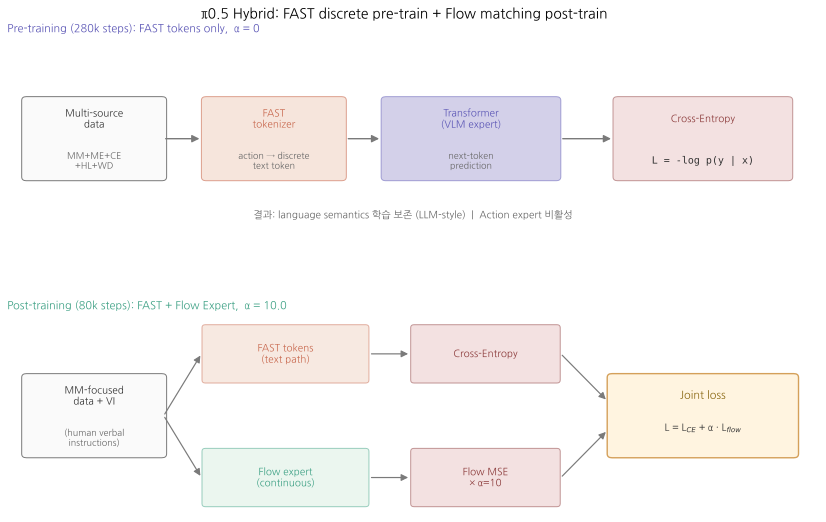
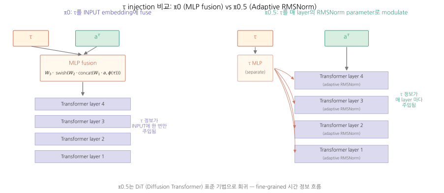
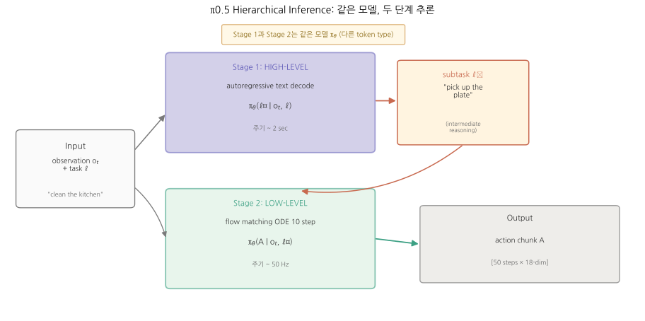
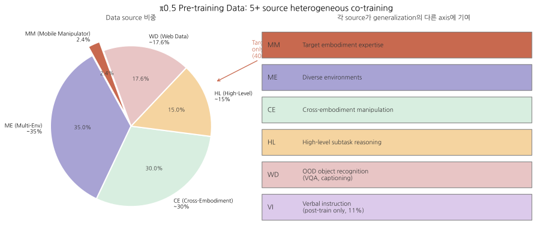

# π0.5: a Vision-Language-Action Model with Open-World Generalization

> **출처**: Physical Intelligence (Black, Brown, Darpinian, ..., Finn, Levine et al.), 2025. arXiv:2504.16054v1 (22 Apr 2025). Blog: https://pi.website/blog/pi05
> **읽은 일자**: 2026-05-26
> **PDF**: [`papers/core-models/π0.5- a Vision-Language-Action Model with Open-World Generalization.pdf`](../../papers/core-models/π0.5-%20a%20Vision-Language-Action%20Model%20with%20Open-World%20Generalization.pdf)
> **분량**: 본문 11 페이지 + 부록 8 페이지 = 19 페이지

---

## 한 줄 요약

**π0의 후속.** π0 architecture에 **(1) 이종 데이터 5+ 종류의 co-training**, **(2) hybrid 학습 (FAST discrete token + Flow matching continuous)**, **(3) 계층적 추론 (same model이 subtask 예측 + action 생성)**을 추가. **400시간의 mobile manipulator data만으로** (그러나 이는 전체 pre-training의 **2.4%**) 학습된 모델이 **학습에 없던 진짜 가정집**에서 **10-15분짜리** kitchen/bedroom 청소 task를 수행. End-to-end learning robot이 unseen real homes에서 long-horizon dexterous task 수행한 **최초 사례**.

## TL;DR

- **π0와 같은 PaliGemma 3B + Action expert 300M** (총 3.3B), 같은 paradigm
- **결정적 차이는 데이터·학습 recipe**: 5종+ 이종 source co-training
  - **MM** (Mobile Manipulator, 400h, 100 homes) — 2.4%
  - **ME** (Multi-Environment non-mobile) — 다양한 가정 환경
  - **CE** (Cross-Embodiment laboratory) — 실험실 다양한 robot
  - **HL** (High-Level subtask prediction) — chain-of-thought style
  - **WD** (Web Data) — VQA, captioning, object localization
  - **VI** (Verbal Instruction, post-training only) — human-given language demos
- **Hybrid action representation**:
  - Pre-training: **FAST tokens** (discrete, autoregressive, 학습 빠름)
  - Post-training: **Flow matching action expert** 추가 (continuous, 실시간 추론)
- **계층적 추론**: 같은 모델로 (a) `"clean kitchen"` → `"pick up the plate"` subtask 예측, (b) subtask → action chunk 생성
- **τ injection 변경**: π0의 MLP fusion → **π0.5의 adaptive RMSNorm** (DiT-style)
- **검증**: 학습에 없던 **3개 실제 가정집**에서 kitchen/bedroom 청소, 10-15분 multi-stage 성공
- **97.6% non-mobile** 데이터로 학습해도 mobile robot generalization 가능 — **scale by diversity, not by quantity**

---

## 1. Motivation & 문제 정의

### 1.1 풀려는 문제

π0가 dexterous task (laundry folding 등)에서 성공했지만, **모든 학습/평가가 lab 환경 또는 한정된 시나리오**에 머무름. 실제로 robot이 유용하려면:
- 학습 때 본 적 없는 **진짜 가정집**에서 작동해야 함
- 새 object, 새 layout, 새 lighting, 새 cabinet handle, ... 무한한 variation
- **kitchen 청소**, **bedroom 정리** 같은 **10-15분 multi-stage** task 수행

**Open-world generalization**이 robotics foundation model의 본질적 미해결 문제.

### 1.2 기존 방법의 한계

| 접근 | 한계 |
|---|---|
| π0 (data 10K hours 만으로) | Lab/일부 환경에 한정. 새 가정집 generalization 검증 없음 |
| 단순 robot data 확장 | Brute force scaling으론 무한한 home variation 못 cover |
| Visual encoder transfer (R3M 등) | Visual representation만 차용. Language reasoning과 결합 안 됨 |
| LLM planner + 별 low-level (SayCan, OK-Robot) | 두 모델 사용. End-to-end로 학습 안 됨. Failure 시 책임소재 불명 |
| Web data co-training (RT-2, OpenVLA) | Web data만 추가. Robot data의 다양성은 그대로 |

→ **여러 source의 robot + non-robot data를 통합한 co-training**이 부재.

### 1.3 본 논문의 가설

> "단일 VLA에 (a) 다양한 robot embodiment + 환경 robot data + (b) high-level subtask 예측 + (c) web data + (d) verbal instruction 데이터를 co-training하면, target embodiment (mobile robot)의 학습 데이터 양이 적어도 (400h, 전체의 2.4%) 새 환경에서 long-horizon task 수행 가능하다."

핵심 가설: **데이터의 양보다 다양성과 modality 조합이 generalization에 결정적**.

## 2. 핵심 아이디어

### 2.1 한 줄

**"π0 architecture + 5+ 종류 이종 데이터 co-training + hybrid (FAST discrete pre-train + Flow matching post-train) + 계층적 inference"**

### 2.2 무엇이 새로운가 (π0 대비)

| 측면 | π0 | π0.5 |
|---|---|---|
| Architecture backbone | PaliGemma 3B + Action Expert 300M | **동일** (같은 backbone, 같은 expert) |
| Action 표현 | Flow matching only (continuous) | **Hybrid: FAST 토큰 + Flow matching** |
| τ injection | MLP fusion into action embedding | **adaptive RMSNorm at each layer (DiT-style)** |
| Pre-training data | 10K hours own robot + OXE 9.1% | **5+ sources, 97.6% non-MM** (MM 400h만 2.4%) |
| Co-training sources | MM data + OXE | **MM + ME + CE + HL + WD + (VI post-training)** |
| Inference | Single-step | **계층적 (subtask 예측 → action 생성)** |
| Subtask 처리 | High-level VLM (별모델) 옵션 | **Same model이 both** |
| 평가 환경 | Lab + 일부 home | **3개 진짜 미본 가정집** ★ |
| Task 시간 | ~몇 분 dexterous | **10-15분 multi-stage home cleaning** |

### 2.3 LLM/VLM 도구와의 analogy

| LLM/VLM 도구 | π0.5 대응 |
|---|---|
| Multi-task instruction tuning (FLAN, T0) | 5+ data source co-training |
| Chain-of-Thought prompting | High-level subtask 예측 → low-level action |
| Test-time compute (o1-style) | 같은 모델이 reasoning(subtask) 후 generation(action) |
| Hybrid AR + diffusion (PixArt-α 등) | FAST AR + Flow matching dual |
| AdaLN / RMSNorm modulation (DiT, SD3) | **adaptive RMSNorm으로 τ 주입** |
| Human teacher demos for alignment | VI (Verbal Instruction) — human이 subtask 단계로 가르침 |
| Mixture-of-Experts | π0의 MoE 구조 그대로 |
| Synthetic data for OOD | WD (Web Data) + bounding box annotation |

핵심 통찰: π0.5는 **architecture innovation이 아니라 data/training recipe innovation**. LLM 분야의 "data > model" 통찰 (Chinchilla, Tülü 등)이 robotics에 도착한 사례.

## 3. 아키텍처 (상세)

### 3.1 입력 / 출력

| 항목 | 형식 | 차원 |
|---|---|---|
| Vision | 4 RGB cameras (front + rear + 2 wrist) | image patches |
| Language prompt $\ell$ | 자연어 high-level task | text tokens (e.g., "clean the kitchen") |
| Robot state $q_t$ | proprioception (arm joints, gripper, base velocity, torso lift) | **18 or 19 dim** (platform별) |
| Output 1 (subtask) $\hat{\ell}$ | 자연어 subtask | text tokens (e.g., "pick up the plate") |
| Output 2 (action chunk) | $a_t, ..., a_{t+H-1}$ | **H = 50 (paper에서는 H=49로 표기, 동일)**, 18-19 dim per timestep |

**Robot system 추가 디테일** (π0와 다름):
- 4 cameras (π0의 3 cameras에서 1개 추가 — rear)
- Mobile holonomic base (3 DoF)
- Torso lift (1-2 DoF)
- 18-19 DoF total (platform별)

### 3.2 전체 흐름 (indent+arrow notation, alignment 안전)

```
Input
  ├─ 4 camera images (front + rear + left wrist + right wrist)
  ├─ Language prompt  l = "clean the kitchen"
  └─ State  q_t = [arm_angles, gripper, base_vel, lift_pos]   (18-19 dim)
                           |
                           v
       +--- Hierarchical Inference (same model, two stages) ---+
       |                                                       |
       |  Stage 1 (HIGH-LEVEL): autoregressive text generation |
       |    Q: given (images, q_t, l), what subtask next?      |
       |    Output l_hat = "pick up the plate"   (~2s rate)    |
       |                                                       |
       |  Stage 2 (LOW-LEVEL): flow matching action generation |
       |    Q: given (images, q_t, l_hat), action chunk?       |
       |    Output A = [a_t, ..., a_{t+49}]   (50 Hz rate)     |
       +-------------------------------------------------------+
                           |
                           v
       Robot Controller @ 50 Hz (PD control to target poses)
                           |
                           v
       Robot executes action chunk -> new observation -> loop
```

### 3.3 핵심 모듈 1 — Hybrid FAST + Flow Matching


*Pre-training (위)은 FAST 토큰 only, cross-entropy. Post-training (아래)는 FAST + Flow expert 동시 학습, α=10. FAST가 language ability 보존에 결정적.*

#### 3.3.1 두 표현의 trade-off

| 표현 | 장점 | 단점 |
|---|---|---|
| **FAST discrete tokens** (Pertsch 2025, π0-FAST) | 학습 빠름 (cross-entropy, parallelizable). LLM 인프라 그대로 | 추론 시 autoregressive (slow), continuous precision 부족 |
| **Flow matching continuous** (π0 main) | 추론 빠름 (ODE 10 step parallel), continuous action | 학습 느림 (diffusion-style sampling overhead) |

→ **둘 다 쓰자**: pre-train은 FAST로 빠르게, post-train에 flow matching expert 추가.

#### 3.3.2 학습 단계별 loss

**Pre-training (Stage 1, 280k steps)** — Discrete only, $\alpha = 0$:

$$
\mathcal{L}_{\text{pre}}(\theta) = \mathbb{E}_{(x, y) \sim D_{\text{pre}}} \left[ H\big(x_{1:M}, f^\ell_\theta(o_t, \ell)\big) \right]
$$

- $H$: cross-entropy loss over text tokens (FAST action tokens 포함)
- 모든 action이 FAST encoding된 text token으로 표현
- 표준 next-token prediction
- Action expert 비활성화

**Post-training (Stage 2, 80k steps)** — Joint, $\alpha = 10.0$:

$$
\mathcal{L}_{\text{post}}(\theta) = \mathbb{E}_{(x, y), \tau, \omega} \left[ H\big(x_{1:M}, f^\ell_\theta\big) + \alpha \, \big\| \omega - a_{t:t+H} - f^a_\theta(a^{\tau, \omega}_{t:t+H}, o_t, \ell) \big\|^2 \right]
$$

- 첫 항: cross-entropy (text 능력 보존)
- 둘째 항: flow matching MSE (continuous action 학습)
- $f^a_\theta$: action expert output (random init, post-training에서 학습 시작)
- $a^{\tau, \omega}_{t:t+H} = \tau a_{t:t+H} + (1-\tau)\omega$: noisy action
- 학습되는 velocity: $\omega - a_{t:t+H}$ (π0과 동일 부호)

**핵심**: post-training은 양쪽 표현(autoregressive text + flow matching)을 **모두 학습**. 추론 시:
- Subtask 예측: text token autoregressive
- Action 생성: flow matching ODE 10 step

#### 3.3.3 Attention masking — 두 action 표현이 서로 안 보게

π0.5의 attention pattern은 다음과 같이 정교함 (Figure 18):

```
                    | images |  text  | state | FAST | flow |
                    | + lang | prompt |  q_t  | tokens|expert|
-------------------+--------+--------+-------+------+------+
   images + lang   |  bi-di |   ^    |   ^   |  ^   |  ^   |  (prefix: bidirectional within)
   text prompt     |   v    |  bi-di |   ^   |  ^   |  ^   |
   state q_t       |   v    |   v    |  bi-di|  ^   |  ^   |
   FAST tokens     |   v    |   v    |   v   | causal|  X  |  (autoregressive)
   flow expert     |   v    |   v    |   v   |  X   | bi-di|  (chunk bidirectional)
-------------------+--------+--------+-------+------+------+
                              "v" = attends to (previous block)
                              "^" = cannot see (future block)
                              "X" = blocked (no cross-talk between FAST and flow)
                              "bi-di" = bidirectional within block
                              "causal" = autoregressive within block
```

**중요한 발견**:
- **VLM 부분 (images + text + state)**: prefix bidirectional, action 부분 못 봄 → π0 pre-training 보존
- **FAST tokens**: autoregressive (다음 token이 이전만 봄)
- **Flow expert tokens**: chunk 내 bidirectional, but **FAST tokens 못 봄** ← 두 action 표현 간 leakage 방지
- 정보 흐름: VLM → FAST → (지식 보호) → Flow expert → action

이 mask design이 **하나의 모델 안에 두 표현이 공존**할 수 있게 한 핵심.

### 3.4 핵심 모듈 2 — Adaptive RMSNorm for τ Injection


*π0 (왼쪽): τ를 input embedding에 MLP로 한 번 주입. π0.5 (오른쪽): τ를 별도 MLP로 임베딩 후 매 layer의 RMSNorm parameter를 modulate (DiT-style).*

**π0와 π0.5의 차이가 가장 클 부분.**

| | π0 | π0.5 |
|---|---|---|
| τ injection 위치 | Input embedding에 fuse | **각 layer의 RMSNorm parameter modulate** |
| 메커니즘 | `W3 · swish(W2 · concat(W1·a, ϕ(τ)))` (MLP) | **adaptive RMSNorm** with `swish(W2·swish(W1·ϕ(τ)))` |

π0.5의 τ injection 수식:

$$
\text{emb}(\tau) = \text{swish}\left( W_2 \cdot \text{swish}\left( W_1 \cdot \phi(\tau) \right) \right) \in \mathbb{R}^w
$$

- $\phi(\tau)$: sinusoidal positional encoding (π0과 동일)
- $W_1, W_2 \in \mathbb{R}^{w \times w}$
- 결과 $\text{emb}(\tau)$가 **adaptive RMSNorm**의 scale/shift parameter 생성

각 layer에서:
$$
\text{RMSNorm}_\tau(x) = \gamma(\tau) \cdot \frac{x}{\sqrt{\frac{1}{w}\sum x_i^2 + \epsilon}} + \beta(\tau)
$$

→ DiT(Diffusion Transformer)의 AdaLN-Zero와 거의 동일. **표준 diffusion transformer 기법으로 회귀**.

**왜 π0와 다르게 했나?**
- π0의 MLP fusion: τ가 input level에서 한 번만 주입. 모든 layer가 같은 τ context로 작동.
- π0.5의 RMSNorm modulation: τ가 **모든 layer**에서 normalization을 조정. 더 fine-grained 시간 정보 흐름.
- π0-small이 이미 AdaLN-Zero를 썼고 π0 main이 MLP fusion → π0.5에서 다시 AdaLN-style로 통일.
- SmolVLA도 AdaLN 방식 (앞 정독에서 다룸)

→ Diffusion transformer 분야의 sustained best practice가 robotics flow matching에서도 입증.

### 3.5 계층적 추론 (Hierarchical Inference)

π0.5의 가장 다른 시스템 디자인.


*같은 모델 π_θ가 두 단계 추론: Stage 1 (~2s 주기)로 subtask 텍스트 생성, Stage 2 (50 Hz)로 action chunk 생성. Chain-of-Thought의 robotics 응용.*

#### 3.5.1 두 수준 분해

$$
\pi_\theta(a_{t:t+H}, \hat{\ell} \mid o_t, \ell) = \pi_\theta(a_{t:t+H} \mid o_t, \hat{\ell}) \cdot \pi_\theta(\hat{\ell} \mid o_t, \ell)
$$

기호:
- $\ell$: high-level task ("clean the kitchen")
- $\hat{\ell}$: predicted subtask ("pick up the plate")
- $a_{t:t+H}$: low-level action chunk
- $o_t$: 관측 (images + state)

**핵심**: action 분포가 $\ell$에 직접 의존하지 않음 — $\hat{\ell}$만 본다. 이는 **clean separation**:
- High-level inference: $o_t, \ell$ → $\hat{\ell}$ (semantic reasoning)
- Low-level inference: $o_t, \hat{\ell}$ → action (motor control)

#### 3.5.2 같은 모델로 두 단계 수행

전통적 접근 (SayCan, OK-Robot 등): **별 VLM (high-level) + 별 policy (low-level)**.

π0.5의 접근: **단일 모델 π_θ가 둘 다 수행**:
- Stage 1: text token autoregressive로 $\hat{\ell}$ 생성 (~2초 주기, 1-2초 분량 subtask)
- Stage 2: flow matching ODE 10 step로 action chunk 생성 (50 Hz 주기)

**Chain-of-Thought 연장**:
- LLM CoT: text → text (reasoning chain)
- π0.5: (image, text) → text (subtask) → action

#### 3.5.3 실제 inference loop

```
loop forever:
    o_t = observe()
    if time_to_replan_subtask:               # ~2s 주기
        l_hat = autoregressive_decode(VLM, o_t, l)  # "pick up plate"
    else:
        keep current l_hat
    A = flow_matching_decode(action_expert, o_t, l_hat)  # 50 Hz
    execute(A)
```

### 3.6 전체 architecture 다이어그램

```
        +------------+   +---------+    +----------+
        | 4 RGB cams |   | "clean  |    | q_t      |
        | 224x224x3  |   | kitchen"|    | 18-19 d  |
        +-----+------+   +----+----+    +----+-----+
              |               |              |
              v               v              v
        +-----+------+   +----+----+    +----+-----+
        | SigLIP ViT |   | Token-  |    | Linear   |
        | (400M)     |   | izer    |    | proj     |
        +-----+------+   +----+----+    +----+-----+
              |               |              |
              +-------+-------+--------+-----+
                      |
                      v
        +-------------+-------------------+
        | PaliGemma 3B (Gemma 2B + ViT)  |
        |                                 |
        | Single Transformer, MoE:        |
        |  - VLM expert  (2B, w=2048)     |
        |  - Action expert (300M, w=1024) |
        |                                 |
        | Two outputs per token type:     |
        |  (a) text logits  -> subtask    |
        |  (b) action expert head         |
        |     -> velocity field           |
        +-----+--------------------+------+
              |                    |
              v                    v
        +-----+-------+    +-------+--------+
        | autoregress |    | flow matching  |
        | text decode |    | ODE 10 steps   |
        | (subtask)   |    | (action chunk) |
        +-------------+    +----------------+

       (Two-stage inference: subtask first, then action)
```

## 4. 데이터 (상세)

### 4.1 5+ Data Source 통합 (가장 큰 contribution)


*5+ source heterogeneous co-training. MM (target) 2.4%에 불과, 나머지 97.6%가 다른 source. 각 source가 generalization의 다른 axis (manipulation, OOD object, reasoning, ...)에 기여.*

#### Pre-training mixture (97.6% non-mobile-manipulator)

| Source | 약자 | 비중 | 내용 |
|---|---|---|---|
| Mobile Manipulator (target) | MM | **2.4%** | 400 hours, 100 homes, 같은 robot platform |
| Multi-Environment non-mobile | ME | 대부분 | Single/dual-arm robots in diverse homes |
| Cross-Embodiment laboratory | CE | 대부분 | Various robots in lab tabletop |
| High-Level subtask prediction | HL | 일정 비중 | Robot scene → subtask label (multi-task) |
| Web Data | WD | 일정 비중 | CapsFusion, COCO, Cambrian-7M, PixMo, VQAv2, object localization |

**중요한 관찰**:
- **MM data가 2.4%**에 불과 → 절대 양이 핵심이 아님
- 다른 data가 **97.6%** → 다양한 modality와 robot에서의 transfer가 결정적

#### Post-training mixture (specialization)

- MM + ME (target embodiment에 맞게)
- WD (semantic 능력 보존)
- HL (multi-environment subset)
- **VI (Verbal Instruction)** ← **post-training only, 새로운 type**
- CE 제거 (lab data는 specialization에 부적합)

#### VI (Verbal Instruction) — π0.5의 새로운 supervision modality

**무엇인가**: 사람 전문가가 robot에게 **실시간으로 subtask를 말로** 지시 → robot은 trained low-level policy로 그것 실행 → 그 trajectory가 학습 data가 됨.

```
Expert: "open the drawer"  -> robot opens drawer
Expert: "pick up the mitten" -> robot picks up
Expert: "put it in the drawer" -> robot puts in
...
```

이 sequence가 **high-level subtask sequence의 demonstration**이 됨. ~11%의 high-level mobile manipulation data지만 **결정적** (ablation에서 입증).

**왜 VI가 가치가 있나?**
- Subtask 자동 label은 cost 큼 (annotation)
- 인간이 직접 robot을 말로 가이드 → 자연스러운 subtask sequence
- High-level policy가 어떤 subtask sequence가 좋은지 학습
- LLM의 **RLHF / Constitutional AI**의 robotics 버전

### 4.2 Action 표기 표준화

모든 action 데이터 처리:
- Target joint and end-effector pose 둘 다 학습
- Control mode marker: `'<control mode> joint <control mode>'` 또는 `<end_effector>`
- Action 정규화: 각 차원의 **1% 및 99% quantile**로 [-1, 1] 정규화 (OpenVLA에서 본 quantile-based discretization과 유사)
- 가장 큰 robot 기준 dimension 통일 + zero-pad (π0과 동일)

### 4.3 Mobile Manipulator robot system (target embodiment)

| 구성 요소 | 사양 |
|---|---|
| Arms | 2 × 6-DoF arm with parallel jaw gripper (12 DoF) |
| Cameras | 4 (front + rear + left wrist + right wrist) |
| Base | 3-DoF holonomic wheeled |
| Torso lift | 1-2 DoF (up/down + opt forward/back) |
| Total DoF | **18 or 19** (platform별) |
| Control | 50 Hz, simple PD targets |
| 학습/추론 모두 end-to-end | navigation + manipulation 둘 다 학습 |

특이점: **navigation controller 없음**. π0.5가 base velocity까지 직접 출력.

## 5. 학습 (상세)

### 5.1 두 단계 학습 recipe

#### Stage 1: Pre-training (280k steps)

- 모든 데이터 사용 (MM + ME + CE + HL + WD)
- 모든 token이 **FAST discrete** (Pertsch 2025의 compression-based tokenizer)
- Loss: standard cross-entropy (next-token prediction)
- Action expert **비활성화** (사용 안 함)
- 학습 빠르고 scalable

#### Stage 2: Post-training (80k steps)

- 데이터 축소·정제: MM + ME (target에 가까운) + WD + HL (subset) + VI (new)
- **두 표현 동시 학습**:
  - Text/FAST tokens: cross-entropy
  - Action expert: flow matching MSE
- $\alpha = 10.0$ (flow matching loss 가중치)
- Action expert는 random init → 학습 시작

### 5.2 Hyperparameter

| Hyperparameter | 값 |
|---|---|
| Pre-training steps | 280,000 |
| Post-training steps | 80,000 |
| Action chunk H | 50 (paper says 49 + 1, equivalent) |
| Flow matching ODE steps | 10 |
| α (post-training, flow MSE weight) | 10.0 |
| Action expert width | 1024 |
| Action expert mlp_dim | 4096 |
| Action expert params | 300M |
| Total params | 3.3B (PaliGemma 3B + 300M) |
| τ sampling | shifted Beta(1.5, 1), s=0.999 (π0과 동일) |

### 5.3 학습 recipe의 의미 — LLM 패턴 그대로

π0가 pre/post training을 도입했고, π0.5가 그것을 **2-stage hybrid representation training**으로 진화:

| Stage | π0 | π0.5 |
|---|---|---|
| Pre | Flow matching, diverse mixed-quality | FAST discrete, ultra-diverse 5 sources |
| Post | Flow matching, task-specific high-quality | Hybrid (FAST + Flow), specialized for MM |

이 evolution은 LLM에서:
- GPT-3: next-token AR pre-train + fine-tune
- GPT-4: pre-train + SFT + RLHF
처럼 단계적 진화와 유사.

## 6. 평가 (상세)

### 6.1 평가 환경 — 미본 진짜 가정집 ★

**π0.5의 가장 중요한 contribution**:

- Mock home (controlled, reproducible) + **real homes** (3개, 학습에 없던 진짜 거주 공간)
- 평가 task:
  - Kitchen: dishes in sink, items in drawer, wipe spill, close cabinets
  - Bedroom: laundry in basket, make bed
- 각 task는 multi-stage (2-5분), 전체 sequence는 10-15분

이는 **end-to-end VLA가 진짜 unseen home에서 long-horizon task 수행한 최초**.

### 6.2 5가지 핵심 실험 결과

#### Q1: 진짜 가정집에서 작동하는가? → **YES**

- 3개 real homes (Home 1, 2, 3) × 다양한 task → 일관되게 성공
- High-level command (`"place the dishes in the sink"`)만 주면 모델이 자체 subtask 분해

#### Q2: Generalization이 환경 수에 따라 어떻게 scale하나?

학습 환경 수: 3, 12, 22, 53, 82, **104**.

| 학습 환경 수 | Avg task progress | 비고 |
|---|---|---|
| 3 | low | |
| 12 | medium | |
| 53 | high | |
| **104 (full)** | **highest** | "trained on test home" baseline에 근접 |

**결정적 발견**:
- "Test home에서 직접 학습" baseline (green bar)이 학습 데이터 없이 다른 home에서만 학습한 모델보다 약간 좋음
- π0.5 (104 location)이 **이 baseline에 근접** → "co-training이 효과적으로 test home에서 학습한 것 같은 성능"
- **No-cotraining baseline** (yellow): MM data만 사용 → 훨씬 떨어짐
- → **co-training이 데이터 양 부족을 보완**

#### Q3: 각 co-training source가 얼마나 중요한가?

Ablation: full vs no-WD, no-ME, no-CE, no-ME&CE

| 제거된 source | End-to-end perf | Language following OOD |
|---|---|---|
| Full π0.5 | 100% (baseline) | 100% |
| no-WD | ≈ same | **significant ↓** (OOD objects 인식 못함) |
| no-ME | significantly ↓ | ↓ |
| no-CE | significantly ↓ | ↓ |
| no-ME&CE | strongly ↓ | strongly ↓ |

해석:
- **ME + CE (cross-embodiment from other robots) 결정적** — manipulation 일반화
- **WD (Web data) → OOD object 일반화 결정적** — unseen object 인식
- 각 source가 다른 axis에 기여 → 모두 함께 있어야 generalization 완성

#### Q4: π0 vs π0.5

| Model | Mock home avg | Language following | Notes |
|---|---|---|---|
| π0 (flow matching only) | low | weak | Pre-train no FAST → language 약함 |
| π0-FAST+Flow (개선 baseline) | medium | medium | Hybrid 추가, but no HL/WD |
| **π0.5 (full)** | **highest** | **strongest** | All co-training |

**중요한 통찰**: π0의 큰 부족은 **language following ability**. 이유:
- π0의 pre-training이 flow matching only → language semantics 학습 부족
- π0.5의 FAST pre-training이 LLM-style language abilities 보존
- → **discrete token pre-training이 language 능력 학습에 결정적**

#### Q5: Hierarchical inference의 가치

비교: full π0.5 vs implicit HL (subtask 출력 안 하지만 학습엔 포함) vs no HL (학습에서도 제외) vs GPT-4 HL (외부 LLM planner) vs human HL (oracle)

결과 ordering:
1. **Full π0.5** (best)
2. Implicit HL (close 2nd) — explicit 안 해도 학습에 있으면 잠재 능력
3. Human HL (oracle) — 의외로 3등
4. no-VI ablation — 크게 낮음
5. no-WD ablation — 크게 낮음
6. GPT-4 HL — **가장 나쁨** (in-domain training 없으면 외부 LLM도 못함)
7. no HL — 최저

**중요한 발견**:
- **Verbal Instruction (VI) 데이터 결정적**: 11% 비중인데 제거하면 크게 떨어짐
- **GPT-4보다 π0.5의 자체 high-level이 좋음** → in-domain training이 외부 LLM zero-shot보다 우월
- **Implicit HL이 explicit 거의 따라잡음** → 학습에 포함만 해도 큰 효과 (causal mechanism unclear)

### 6.3 결과 종합

| 발견 | 의미 |
|---|---|
| 97.6% non-MM data로 학습 가능 | **Data diversity > data quantity** (특정 axis에서) |
| Co-training이 test home 학습 baseline 근접 | Generalization is achievable through transfer |
| FAST pre-training이 language ability에 결정적 | Discrete token learning이 semantic 학습에 필수 |
| Verbal Instruction (VI) 결정적 | Human-in-the-loop subtask demos가 가치 큼 |
| In-domain HL이 GPT-4 zero-shot보다 좋음 | Robot-specific HL data가 필요 |
| Real homes 일반화 입증 | π0.5이 open-world 달성한 첫 모델 |

## 7. 강점 / 한계

### 7.1 강점

| 강점 | 구조적 원인 |
|---|---|
| Real home generalization | 5+ source heterogeneous co-training |
| 10-15분 long-horizon task | 계층적 subtask + action 추론 |
| Language following | FAST pre-training + WD + VI 결합 |
| OOD object 일반화 | Web data 결합 |
| Cross-embodiment transfer | ME + CE 양쪽에서 학습 |
| Data-efficient target | MM 데이터 400h만으로 다양한 환경 cover |
| End-to-end navigation + manipulation | 분리된 system 없이 단일 모델 |
| 같은 모델로 high+low level | hierarchy를 단일 model 안에 통합 |

### 7.2 한계 — Mechanism 분석

| 한계 | 구조적 원인 | 후속 모델이 어떻게 해결? |
|---|---|---|
| 일부 환경 실패 (unfamiliar handles 등) | Pre-training이 충분히 다양하지 않은 axis | 더 많은 ME data, RL fine-tune (π★0.6) |
| Subtask 산만 (drawer 열고 닫기 반복) | High-level의 mistake recovery 부족 | 더 강한 reasoning, memory module (π0.7) |
| Partial observability (가려진 spill) | 4 cameras도 모든 angle cover 못함 | Active perception, memory |
| Simple prompts만 처리 | 학습 데이터의 instruction이 단순 | 더 복잡한 instruction annotation |
| Modest context | Multi-room navigation에 부족 | π0.7의 memory module 등 |
| 일부 task에 verbal instruction 의존 | VI data 비중 한정 | RL self-improvement (π★0.6 의 RECAP) |

→ 한계 대부분이 **데이터/recipe 개선으로** 해결 가능 (architecture는 충분).

## 8. 다른 모델과의 관계

### 8.1 직접적 선행

- **[[pi0]]** (Black 2024): π0.5의 직접 baseline. Architecture 동일, 데이터·학습 recipe만 차별화
- **[[FAST]]** (Pertsch 2025): Pre-training에서 사용한 action tokenizer. π0-FAST 논문
- **[[OpenVLA]]** (Kim 2024): Token-based 대안. π0.5는 OpenVLA의 token approach와 π0의 flow matching을 hybrid로 통합
- **PaliGemma** (Beyer 2024): VLM backbone (π0와 동일)
- **SayCan / RT-2 with CoT**: hierarchical inference의 conceptual ancestor

### 8.2 후속 (본 프로젝트 8편과의 관계)

| 후속 | π0.5와의 관계 |
|---|---|
| **[[pi-star-0.6]]** (다음 정독) | π0.5 + **RL self-improvement (RECAP)**. Mistake recovery 강화 |
| **[[pi0.7]]** | π★0.6 + steerable + memory module |
| **[[SmolVLA]]** (이미 정독) | π0.5보다 이전 paradigm. 같은 PI 영감, lightweight version |
| **[[GR00T-N1]]** (NVIDIA) | π0.5 paradigm + humanoid extension |

### 8.3 Architecture-Evolution Tree

```
                     pi0 (anchor)
                    /    |    \
                   /     |     \
                  /      |      \
             pi0-FAST  pi0.5  SmolVLA
            (token     (5+co-  (lightweight
             format)   train)    fork)
                         |
                         v
                     pi*0.6 (+ RL)
                         |
                         v
                      pi0.7 (+ memory)
                                 \
                                  v
                              GR00T N1 (humanoid)
```

**π0.5는 π0의 가장 큰 변형**: architecture는 거의 같지만 학습 recipe·data가 완전히 다름. **5/8 정독에서 한 분기**.

## 9. 우리 스터디에서 재현·실험 가능한 포인트

### 9.1 재현 가능성

- **π0.5 weights**: closed (Physical Intelligence)
- **openpi reimplementation**: π0.5 코드도 일부 공개 가능성
- **재현 난이도**:
  - Full pre-training: 매우 어려움 (5+ source 데이터 수집/curation)
  - Architecture 재현: π0 재현에 FAST + dual loss + hierarchical inference 추가
  - Hands-on에서 가장 가치: **co-training mixture 실험**

### 9.2 LeRobot / openpi 호환성

- **LeRobot**: SmolVLA 친화적. π0.5의 5+ source 다 흡수하긴 어렵지만 multi-task training 가능
- **openpi**: π0 시리즈의 공식 reimpl. π0.5 architecture 가장 가까이 따를 stack
- 주의: **VI (Verbal Instruction) data 수집은 사람 시간 소모** — 우리 스터디에선 자동 생성으로 대체 가능 (LLM이 시뮬레이션)

### 9.3 흥미로운 ablation / new idea 후보 (Track c)

| Idea | 메커니즘 | 기대 효과 | 난이도 |
|---|---|---|---|
| Co-training source 추가 ablation | π0.5의 5 source 외에 다른 source 추가 (audio, tactile) | 새 modality의 가치 정량화 | 높음 |
| MM data ratio sweep | 0.5%, 2.4%, 10%, 50%, 90% | "target data가 어느 정도여야?" sweet spot | 중간 |
| FAST vs Flow 비율 sweep | $\alpha$ 0.1 ~ 100 | Hybrid 학습 균형 | 낮음 |
| VI를 LLM이 자동 생성 | Human 대신 GPT-4가 subtask sequence 생성 | VI scale up 가능성 | 중간 |
| τ injection 비교 | π0 MLP fusion vs π0.5 RMSNorm vs SmolVLA AdaLN | 어느 게 robotics에 최적? | 낮음 |
| Hierarchical inference 분리 | 같은 모델 → 다른 모델로 분리 | End-to-end vs decoupled | 중간 |
| Subtask granularity sweep | 0.5s, 2s, 5s, 10s subtask | Optimal abstraction level | 중간 |
| Web data composition ablation | CapsFusion vs COCO vs Cambrian vs VQAv2 sub-ablation | 어느 web data가 가장 중요? | 낮음 |

### 9.4 LLM 엔지니어 관점 — 한 페이지 요약

π0.5를 한 문장: **"π0의 architecture에 LLM-style multi-task instruction tuning + FAST pre-train + Flow matching post-train + hierarchical chain-of-thought 추론을 결합한 generalist robot foundation model"**

| 단계 | LLM/VLM 도구와의 직접 mapping |
|---|---|
| 1. Pre-training (FAST) | GPT-style autoregressive pre-training |
| 2. Co-training (5+ sources) | Tülü, FLAN-style multi-task tuning |
| 3. Hierarchical inference | Chain-of-Thought + Test-time compute (o1-style) |
| 4. Post-training (FAST + Flow) | RLHF의 alignment fine-tune phase 유사 |
| 5. Verbal Instruction | Constitutional AI / Anthropic의 human-in-the-loop |
| 6. Adaptive RMSNorm for τ | DiT / SD3의 standard τ injection |
| 7. End-to-end navigation + manipulation | Multi-modal output (text + action) |
| 8. Real home eval | Production deployment evaluation |

→ **π0.5는 LLM 분야의 alignment 기법을 robotics에 가장 광범위하게 적용한 사례**. 새로 배워야 할 robotics-specific 개념 매우 적음.

---

## 부록: 인용 / 추가 자료

### A. 함께 읽기

- **[[pi0]]** (이미 정독) — π0.5의 직접 baseline
- **[[pi-star-0.6]]** (다음 정독 대상) — π0.5 + RL
- **[[FAST]]** (Pertsch 2025) — Action tokenizer
- **[[SmolVLA]]** (이미 정독) — π0 lineage의 lightweight 변형
- **[[OpenVLA]]** (이미 정독) — Token-based 대안
- **DiT** (Peebles 2023) — Adaptive RMSNorm의 origin
- **Stable Diffusion 3** (Esser 2024) — Hybrid AR + diffusion approach

### B. 공식 자료

- Blog: https://pi.website/blog/pi05 (real home demo videos)
- Code: **closed** (PI proprietary)
- openpi 커뮤니티 재구현: 진행 중

### C. 본 정독 중 발견한 핵심 통찰

1. **"Quantity vs Diversity" trade-off**: π0.5가 MM data 400h(2.4%)만으로 충분 → **diversity가 quantity를 능가**. 이는 LLM의 Instruction Tuning 발견과 정확히 일치 (수십 데이터로 base model의 행동 변경 가능).

2. **FAST pre-training의 language preservation**: π0의 flow matching only pre-training은 language ability 손상. π0.5의 FAST + cross-entropy pre-training은 LLM-style language 능력 유지 → 이는 **discrete token 학습이 semantic generalization에 필수**임을 시사.

3. **Verbal Instruction의 leverage**: 11% data로 큰 효과 → high-quality, structured 데이터의 가치. **LLM RLHF의 robotics 버전** — 사람의 high-level reasoning을 모델에 직접 transferring.

4. **Implicit HL의 효과**: 학습에 HL 포함만 해도 explicit HL inference 거의 따라잡음. → **Multi-task training의 "task spillover"** 효과가 robotics에도 적용.

5. **GPT-4가 in-domain π0.5보다 나쁨**: 일반 LLM의 robotics 적용 한계 명확. **Domain-specific fine-tuning** 필수.

6. **Adaptive RMSNorm 회귀**: π0의 MLP fusion → π0.5의 RMSNorm. SD3 (Esser 2024)의 표준 기법으로 통일. **Robotics가 image generation의 best practice를 채택**.

### D. SmolVLA / π0 / π0.5 핵심 비교 (3-way)

| 차원 | SmolVLA (2025-06) | π0 (2024-10) | π0.5 (2025-04) |
|---|---|---|---|
| Params | 450M | 3.3B | 3.3B |
| VLM backbone | SmolVLM-2 (450M) | PaliGemma (3B) | PaliGemma (3B) |
| VLM 학습 | Frozen, layer skip | Trainable | Trainable |
| Action 표현 | Flow matching | Flow matching | **Hybrid: FAST + Flow** |
| Architecture | Two transformers + CA | MoE single transformer | Same as π0 |
| Action mask | Causal within | Bidirectional within | Bidirectional within |
| τ injection | AdaLN | MLP fusion | **adaptive RMSNorm** |
| Pre-training data | 23K episodes (SO-100) | 10K hours (7 robots + OXE) | 5+ sources (MM 2.4% only) |
| Pre-training type | Flow matching only | Flow matching | **Discrete (FAST)** |
| Post-training | Combined | Separate phase | **+ Flow matching expert** |
| Hierarchical inference | No | No | **Yes (same model)** |
| Real home eval | Lab + SO-100 | Lab | **3 real homes ★** |
| Open | Full open | Closed | Closed |
| Specialty | Lightweight, async | Dexterous, MoE | **Open-world generalization** |

→ **π0.5는 π0와 같은 architecture로, training recipe만 진화시켜 새로운 능력 달성**.

### E. 다음 정독 (π★0.6) 예측

π0.5의 한계 (mistake recovery, partial observability, subtask 산만 등)를 **RL self-improvement**로 해결할 것 예상.
- 키워드: RECAP (recap, replay, learning)
- 예상 paradigm: pre-training (π0.5) → deployment → 실패 데이터 수집 → offline RL fine-tune
- 본 프로젝트 학습한 모든 도구 (flow matching, hierarchical inference, co-training) 위에 RL 추가

흡수 속도가 빠를 것 예상 — paradigm 안정화됨, 변화는 RL 메커니즘만.
